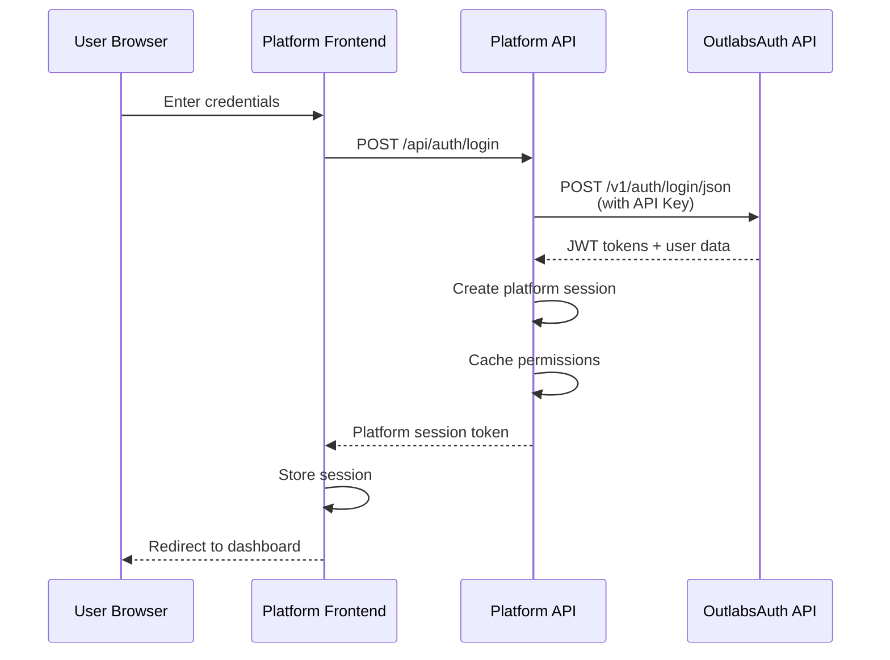
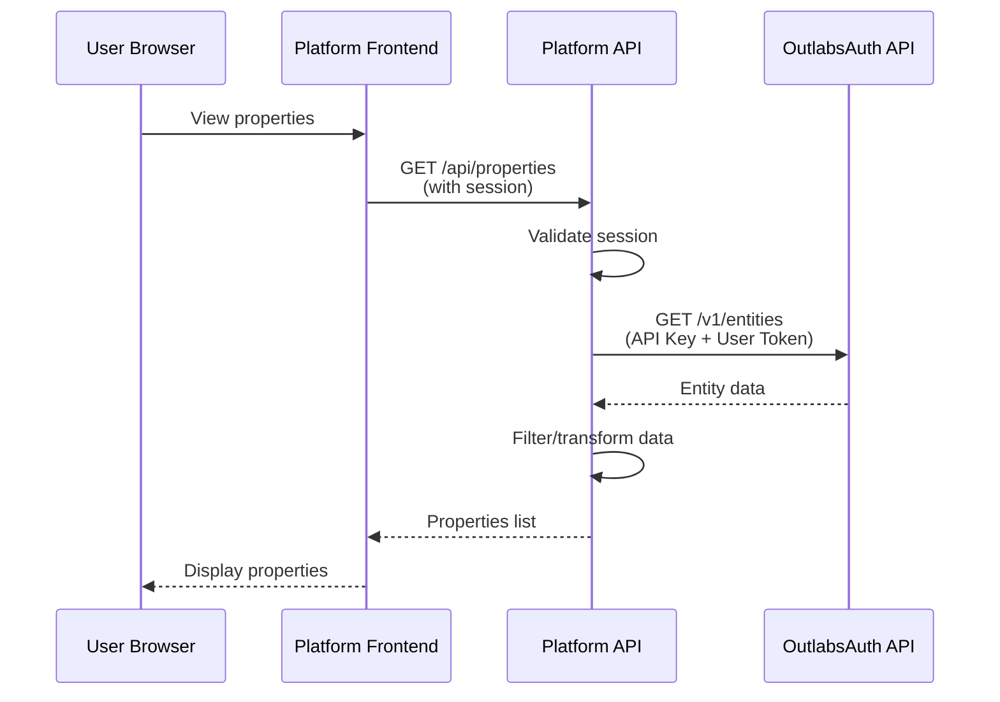

# API Proxy Pattern Guide

This guide explains the recommended proxy pattern for integrating external platforms with OutlabsAuth. The proxy pattern provides the most secure and flexible approach for authentication and authorization in multi-platform environments.

## Table of Contents

1. [Overview](#overview)
2. [Why Use the Proxy Pattern](#why-use-the-proxy-pattern)
3. [Architecture](#architecture)
4. [Implementation Guide](#implementation-guide)
5. [Authentication Flows](#authentication-flows)
6. [API Key Management](#api-key-management)
7. [User Context Handling](#user-context-handling)
8. [OAuth Integration](#oauth-integration)
9. [Security Best Practices](#security-best-practices)
10. [Code Examples](#code-examples)

## Overview

The proxy pattern involves routing all authentication requests through your platform's API rather than having your frontend communicate directly with OutlabsAuth. This approach provides better security, control, and flexibility.

### Basic Flow
```
User Browser → Your Platform Frontend → Your Platform API → OutlabsAuth API
```

### Key Components
- **Frontend**: Your platform's UI (React, Vue, Angular, etc.)
- **Platform API**: Your backend service (Node.js, Python, Ruby, etc.)
- **OutlabsAuth API**: The centralized authentication service
- **API Key**: Platform-level authentication credential
- **User Context**: Optional user-specific information passed through

## Why Use the Proxy Pattern

### 1. **Security Benefits**
- Frontend never exposes OutlabsAuth endpoints
- API keys remain server-side only
- Additional validation layer before auth requests
- Protection against direct API abuse

### 2. **Control & Flexibility**
- Add platform-specific business logic
- Transform requests/responses as needed
- Implement custom rate limiting
- Add platform-specific audit logging

### 3. **Simplified Frontend**
- Frontend only knows about your API
- Consistent error handling
- Single authentication endpoint
- Easier to test and mock

### 4. **Better User Experience**
- Faster response times with caching
- Graceful degradation if OutlabsAuth is down
- Custom error messages
- Platform-specific session management

## Architecture

### High-Level Architecture
```
┌─────────────┐     ┌─────────────────┐     ┌──────────────┐
│   Browser   │────▶│  Platform API   │────▶│ OutlabsAuth  │
│  (Frontend) │◀────│  (Proxy Layer)  │◀────│     API      │
└─────────────┘     └─────────────────┘     └──────────────┘
       │                     │                       │
       │                     │                       │
    Cookies/             API Key +              JWT Tokens
    Session            User Context            Permissions
```

### Component Responsibilities

**Frontend**:
- Manages UI state
- Sends credentials to platform API
- Stores platform session/token
- Never directly contacts OutlabsAuth

**Platform API**:
- Validates requests
- Manages platform sessions
- Uses API key for OutlabsAuth
- Transforms and forwards requests
- Caches permissions/user data

**OutlabsAuth**:
- Validates credentials
- Issues JWT tokens
- Manages permissions
- Provides user/entity data

## Implementation Guide

### Step 1: Setup Platform API Authentication

```javascript
// Platform API configuration
const config = {
  outlabsAuth: {
    baseUrl: process.env.OUTLABS_AUTH_URL || 'https://api.auth.outlabs.com',
    apiKey: process.env.OUTLABS_API_KEY, // e.g., 'plat_property_hub_sk_live_xyz123'
    platformId: process.env.OUTLABS_PLATFORM_ID, // e.g., 'plat_property_hub'
  }
};
```

### Step 2: Create Authentication Service

```javascript
class AuthProxyService {
  constructor(config) {
    this.config = config;
    this.cache = new Map(); // Simple in-memory cache
  }
  
  async login(email, password, metadata = {}) {
    try {
      // 1. Authenticate with OutlabsAuth
      const authResponse = await fetch(`${this.config.outlabsAuth.baseUrl}/v1/auth/login/json`, {
        method: 'POST',
        headers: {
          'Content-Type': 'application/json',
          'X-API-Key': this.config.outlabsAuth.apiKey,
          'X-Platform-Id': this.config.outlabsAuth.platformId
        },
        body: JSON.stringify({ email, password })
      });
      
      if (!authResponse.ok) {
        const error = await authResponse.json();
        throw new AuthenticationError(error.detail || 'Authentication failed');
      }
      
      const authData = await authResponse.json();
      
      // 2. Get user's platform-specific data
      const userData = await this.enrichUserData(authData.user, authData.access_token);
      
      // 3. Create platform session
      const session = await this.createPlatformSession({
        userId: authData.user.id,
        email: authData.user.email,
        outlabsTokens: {
          access: authData.access_token,
          refresh: authData.refresh_token
        },
        platformData: userData,
        metadata
      });
      
      // 4. Cache user permissions
      await this.cacheUserPermissions(authData.user.id, userData.permissions);
      
      // 5. Return platform-specific response
      return {
        user: {
          id: authData.user.id,
          email: authData.user.email,
          profile: authData.user.profile,
          ...userData
        },
        session: {
          token: session.token,
          expiresIn: session.expiresIn
        }
      };
      
    } catch (error) {
      this.logAuthError(error, { email, metadata });
      throw this.transformAuthError(error);
    }
  }
  
  async enrichUserData(user, accessToken) {
    // Get platform-specific user data
    const headers = {
      'Authorization': `Bearer ${accessToken}`,
      'X-API-Key': this.config.outlabsAuth.apiKey
    };
    
    // Fetch user's entities and permissions in platform context
    const [entities, permissions] = await Promise.all([
      this.fetchUserEntities(user.id, headers),
      this.fetchUserPermissions(user.id, headers)
    ]);
    
    return {
      entities,
      permissions,
      platformRole: this.determinePlatformRole(entities, permissions)
    };
  }
}
```

### Step 3: Implement Middleware for API Calls

```javascript
// Middleware to forward authenticated requests to OutlabsAuth
async function outlabsAuthProxy(req, res, next) {
  const session = req.session;
  
  if (!session || !session.outlabsTokens) {
    return res.status(401).json({ error: 'Not authenticated' });
  }
  
  try {
    // Make request to OutlabsAuth with both API key and user token
    const response = await fetch(`${config.outlabsAuth.baseUrl}${req.path}`, {
      method: req.method,
      headers: {
        'X-API-Key': config.outlabsAuth.apiKey,
        'Authorization': `Bearer ${session.outlabsTokens.access}`,
        'X-User-Context': session.userId,
        'Content-Type': 'application/json'
      },
      body: req.body ? JSON.stringify(req.body) : undefined
    });
    
    // Handle token refresh if needed
    if (response.status === 401) {
      const refreshed = await refreshAccessToken(session.outlabsTokens.refresh);
      if (refreshed) {
        session.outlabsTokens = refreshed;
        // Retry request with new token
        return outlabsAuthProxy(req, res, next);
      }
    }
    
    const data = await response.json();
    res.status(response.status).json(data);
    
  } catch (error) {
    next(error);
  }
}

// Apply to specific routes
app.use('/api/outlabs/*', outlabsAuthProxy);
```

## Authentication Flows

### 1. Login Flow



### 2. Authenticated Request Flow



### 3. Token Refresh Flow

```javascript
async function refreshAccessToken(refreshToken) {
  try {
    const response = await fetch(`${config.outlabsAuth.baseUrl}/v1/auth/mobile/refresh`, {
      method: 'POST',
      headers: {
        'Content-Type': 'application/json',
        'X-API-Key': config.outlabsAuth.apiKey
      },
      body: JSON.stringify({ refresh_token: refreshToken })
    });
    
    if (!response.ok) {
      return null; // Refresh failed, user must re-login
    }
    
    const tokens = await response.json();
    return {
      access: tokens.access_token,
      refresh: tokens.refresh_token
    };
    
  } catch (error) {
    console.error('Token refresh failed:', error);
    return null;
  }
}
```

## API Key Management

### API Key Structure
```
plat_<platform>_<environment>_<key>
```

Examples:
- `plat_property_hub_sk_live_a1b2c3d4e5f6`
- `plat_property_hub_sk_test_x9y8z7w6v5u4`

### Secure Storage

```javascript
// Environment variables (recommended)
OUTLABS_API_KEY_LIVE=plat_property_hub_sk_live_a1b2c3d4e5f6
OUTLABS_API_KEY_TEST=plat_property_hub_sk_test_x9y8z7w6v5u4

// AWS Secrets Manager
const AWS = require('aws-sdk');
const secretsManager = new AWS.SecretsManager();

async function getApiKey() {
  const secret = await secretsManager.getSecretValue({
    SecretId: 'outlabs-auth-api-key'
  }).promise();
  
  return JSON.parse(secret.SecretString).apiKey;
}

// HashiCorp Vault
const vault = require('node-vault')();

async function getApiKey() {
  const secret = await vault.read('secret/data/outlabs-auth');
  return secret.data.data.apiKey;
}
```

### Key Rotation

```javascript
class ApiKeyRotation {
  async rotateApiKey() {
    // 1. Generate new API key in OutlabsAuth
    const newKey = await this.generateNewApiKey();
    
    // 2. Update key in secure storage
    await this.updateStoredKey(newKey);
    
    // 3. Test new key
    const isValid = await this.testApiKey(newKey);
    if (!isValid) {
      throw new Error('New API key validation failed');
    }
    
    // 4. Deploy with new key (blue-green deployment)
    await this.deployWithNewKey(newKey);
    
    // 5. Revoke old key after grace period
    setTimeout(async () => {
      await this.revokeOldKey(this.currentKey);
    }, 24 * 60 * 60 * 1000); // 24 hours
    
    this.currentKey = newKey;
  }
}
```

## User Context Handling

### Passing User Context

When making API calls on behalf of a user, include both API key (for platform auth) and user context:

```javascript
class OutlabsAuthClient {
  async makeUserRequest(endpoint, options = {}, userContext = null) {
    const headers = {
      'X-API-Key': this.apiKey,
      'Content-Type': 'application/json',
      ...options.headers
    };
    
    // Add user context if available
    if (userContext) {
      if (userContext.accessToken) {
        headers['Authorization'] = `Bearer ${userContext.accessToken}`;
      }
      if (userContext.userId) {
        headers['X-User-Context'] = userContext.userId;
      }
      if (userContext.entityId) {
        headers['X-Entity-Context-Id'] = userContext.entityId;
      }
    }
    
    return fetch(`${this.baseUrl}${endpoint}`, {
      ...options,
      headers
    });
  }
}

// Usage examples
// Platform-level operation (no user context)
await client.makeUserRequest('/v1/entities', {
  method: 'GET'
});

// User-specific operation
await client.makeUserRequest('/v1/users/me', {
  method: 'GET'
}, {
  accessToken: session.outlabsTokens.access,
  userId: session.userId
});

// Entity-scoped operation
await client.makeUserRequest('/v1/entities/members', {
  method: 'POST',
  body: JSON.stringify({ user_id: newUserId, role_ids: [roleId] })
}, {
  accessToken: session.outlabsTokens.access,
  userId: session.userId,
  entityId: targetEntityId
});
```

### Permission Checking

```javascript
async function checkUserPermission(session, permission, entityId = null) {
  // Check cache first
  const cacheKey = `${session.userId}:${permission}:${entityId || 'global'}`;
  const cached = permissionCache.get(cacheKey);
  
  if (cached && cached.expiry > Date.now()) {
    return cached.allowed;
  }
  
  // Check with OutlabsAuth
  const response = await outlabsClient.makeUserRequest('/v1/permissions/check', {
    method: 'POST',
    body: JSON.stringify({
      permission,
      entity_id: entityId
    })
  }, {
    accessToken: session.outlabsTokens.access,
    userId: session.userId
  });
  
  const result = await response.json();
  
  // Cache result
  permissionCache.set(cacheKey, {
    allowed: result.allowed,
    expiry: Date.now() + (5 * 60 * 1000) // 5 minutes
  });
  
  return result.allowed;
}
```

## OAuth Integration

### Platform-Managed OAuth Flow

The proxy pattern simplifies OAuth integration by handling it at the platform level:

```javascript
// 1. Platform initiates OAuth flow
app.get('/auth/google', (req, res) => {
  const state = generateSecureState();
  req.session.oauthState = state;
  
  const authUrl = new URL('https://accounts.google.com/o/oauth2/v2/auth');
  authUrl.searchParams.set('client_id', process.env.GOOGLE_CLIENT_ID);
  authUrl.searchParams.set('redirect_uri', `${process.env.APP_URL}/auth/google/callback`);
  authUrl.searchParams.set('response_type', 'code');
  authUrl.searchParams.set('scope', 'openid email profile');
  authUrl.searchParams.set('state', state);
  
  res.redirect(authUrl.toString());
});

// 2. Handle OAuth callback
app.get('/auth/google/callback', async (req, res) => {
  const { code, state } = req.query;
  
  // Validate state
  if (state !== req.session.oauthState) {
    return res.status(400).json({ error: 'Invalid state' });
  }
  
  try {
    // Exchange code for tokens
    const tokens = await exchangeCodeForTokens(code);
    
    // Get user info from Google
    const googleUser = await getGoogleUserInfo(tokens.access_token);
    
    // Create or update user in OutlabsAuth
    const outlabsUser = await createOrUpdateOutlabsUser(googleUser);
    
    // Create platform session
    const session = await createPlatformSession({
      userId: outlabsUser.id,
      email: outlabsUser.email,
      authMethod: 'google',
      googleId: googleUser.sub
    });
    
    res.redirect(`/dashboard?session=${session.token}`);
    
  } catch (error) {
    res.redirect('/login?error=oauth_failed');
  }
});

// 3. Create/update user in OutlabsAuth
async function createOrUpdateOutlabsUser(googleUser) {
  // Check if user exists
  let user = await findUserByEmail(googleUser.email);
  
  if (!user) {
    // Create new user via API
    const response = await fetch(`${config.outlabsAuth.baseUrl}/v1/users`, {
      method: 'POST',
      headers: {
        'X-API-Key': config.outlabsAuth.apiKey,
        'Content-Type': 'application/json'
      },
      body: JSON.stringify({
        email: googleUser.email,
        profile: {
          first_name: googleUser.given_name,
          last_name: googleUser.family_name,
          avatar_url: googleUser.picture
        },
        metadata: {
          google_id: googleUser.sub,
          auth_provider: 'google',
          email_verified: googleUser.email_verified
        }
      })
    });
    
    user = await response.json();
    
    // Add to default entity
    await addUserToDefaultEntity(user.id);
  } else {
    // Update existing user
    await updateUserMetadata(user.id, {
      google_id: googleUser.sub,
      last_google_login: new Date().toISOString()
    });
  }
  
  return user;
}
```

### Supporting Multiple OAuth Providers

```javascript
class OAuthProviderManager {
  constructor() {
    this.providers = {
      google: new GoogleOAuthProvider(),
      github: new GitHubOAuthProvider(),
      microsoft: new MicrosoftOAuthProvider()
    };
  }
  
  async handleOAuthCallback(provider, code, state) {
    const oauthProvider = this.providers[provider];
    if (!oauthProvider) {
      throw new Error(`Unknown OAuth provider: ${provider}`);
    }
    
    // Get OAuth user info
    const oauthUser = await oauthProvider.getUserInfo(code);
    
    // Normalize user data
    const normalizedUser = this.normalizeUserData(provider, oauthUser);
    
    // Create/update in OutlabsAuth
    return this.syncWithOutlabsAuth(normalizedUser);
  }
  
  normalizeUserData(provider, oauthUser) {
    // Map provider-specific fields to standard format
    const mappers = {
      google: (user) => ({
        email: user.email,
        firstName: user.given_name,
        lastName: user.family_name,
        avatar: user.picture,
        providerId: user.sub
      }),
      github: (user) => ({
        email: user.email,
        firstName: user.name?.split(' ')[0],
        lastName: user.name?.split(' ')[1],
        avatar: user.avatar_url,
        providerId: user.id.toString()
      }),
      microsoft: (user) => ({
        email: user.mail || user.userPrincipalName,
        firstName: user.givenName,
        lastName: user.surname,
        avatar: null,
        providerId: user.id
      })
    };
    
    return {
      ...mappers[provider](oauthUser),
      provider,
      rawData: oauthUser
    };
  }
}
```

## Security Best Practices

### 1. API Key Security

```javascript
// Never expose API keys in frontend code
// BAD - Don't do this
const response = await fetch('https://api.auth.outlabs.com/v1/users', {
  headers: {
    'X-API-Key': 'plat_property_hub_sk_live_xyz123' // NEVER DO THIS
  }
});

// GOOD - Proxy through your backend
const response = await fetch('/api/users', {
  headers: {
    'Authorization': `Bearer ${sessionToken}` // Platform session token
  }
});
```

### 2. Request Validation

```javascript
// Validate all incoming requests before forwarding
async function validateProxyRequest(req, res, next) {
  // Check platform session
  if (!req.session || !req.session.isValid()) {
    return res.status(401).json({ error: 'Invalid session' });
  }
  
  // Rate limiting per user
  const rateLimitKey = `api:${req.session.userId}:${req.path}`;
  const requests = await redis.incr(rateLimitKey);
  
  if (requests === 1) {
    await redis.expire(rateLimitKey, 60); // 1 minute window
  }
  
  if (requests > 100) { // 100 requests per minute
    return res.status(429).json({ error: 'Rate limit exceeded' });
  }
  
  // Validate request body
  if (req.body) {
    const validation = validateRequestBody(req.path, req.method, req.body);
    if (!validation.valid) {
      return res.status(400).json({ error: validation.error });
    }
  }
  
  next();
}
```

### 3. Response Filtering

```javascript
// Filter sensitive data before sending to frontend
function filterSensitiveData(response, userPermissions) {
  // Remove internal fields
  delete response._internal;
  delete response.hashed_password;
  
  // Filter based on permissions
  if (!userPermissions.includes('user:view_email')) {
    response.users?.forEach(user => {
      delete user.email;
    });
  }
  
  if (!userPermissions.includes('financial:view')) {
    delete response.commission_data;
    delete response.payment_info;
  }
  
  return response;
}
```

### 4. Audit Logging

```javascript
// Log all authentication-related activities
class AuditLogger {
  async logAuthActivity(activity, context) {
    const entry = {
      timestamp: new Date().toISOString(),
      activity,
      platform_id: context.platformId,
      user_id: context.userId,
      ip_address: context.ipAddress,
      user_agent: context.userAgent,
      success: context.success,
      error: context.error,
      metadata: context.metadata
    };
    
    // Store in your audit system
    await this.auditStore.create(entry);
    
    // Alert on suspicious activity
    if (this.isSuspicious(activity, context)) {
      await this.alertSecurityTeam(entry);
    }
  }
  
  isSuspicious(activity, context) {
    // Multiple failed logins
    if (activity === 'login_failed' && context.failureCount > 5) {
      return true;
    }
    
    // Unusual location
    if (context.ipLocation && context.ipLocation !== context.userNormalLocation) {
      return true;
    }
    
    // Rapid permission escalation attempts
    if (activity === 'permission_denied' && context.recentDenials > 10) {
      return true;
    }
    
    return false;
  }
}
```

## Code Examples

### Complete Express.js Implementation

```javascript
const express = require('express');
const session = require('express-session');
const redis = require('redis');
const { OutlabsAuthClient } = require('./outlabs-auth-client');

const app = express();
const authClient = new OutlabsAuthClient({
  baseUrl: process.env.OUTLABS_AUTH_URL,
  apiKey: process.env.OUTLABS_API_KEY,
  platformId: process.env.PLATFORM_ID
});

// Session middleware
app.use(session({
  secret: process.env.SESSION_SECRET,
  resave: false,
  saveUninitialized: false,
  store: new RedisStore({ client: redis.createClient() })
}));

// Authentication routes
app.post('/api/auth/login', async (req, res) => {
  try {
    const { email, password } = req.body;
    
    // Authenticate with OutlabsAuth
    const authResult = await authClient.login(email, password);
    
    // Create platform session
    req.session.userId = authResult.user.id;
    req.session.outlabsTokens = authResult.tokens;
    req.session.permissions = authResult.permissions;
    
    res.json({
      user: authResult.user,
      sessionToken: req.sessionID
    });
    
  } catch (error) {
    res.status(401).json({ error: error.message });
  }
});

// Proxy middleware for OutlabsAuth API
app.use('/api/outlabs', 
  requireAuth,
  validateProxyRequest,
  async (req, res) => {
    try {
      const response = await authClient.proxyRequest({
        path: req.path.replace('/api/outlabs', ''),
        method: req.method,
        body: req.body,
        userContext: {
          userId: req.session.userId,
          accessToken: req.session.outlabsTokens.access
        }
      });
      
      res.json(response);
      
    } catch (error) {
      res.status(error.status || 500).json({ error: error.message });
    }
  }
);

// Platform-specific endpoints
app.get('/api/properties', requireAuth, async (req, res) => {
  // Get properties with user context
  const canViewAll = req.session.permissions.includes('property:view_all');
  
  const properties = await getProperties({
    userId: canViewAll ? null : req.session.userId,
    filters: req.query
  });
  
  res.json({ properties });
});

app.listen(3000, () => {
  console.log('Platform API listening on port 3000');
});
```

### Python Flask Implementation

```python
from flask import Flask, request, session, jsonify
import requests
from functools import wraps
import os

app = Flask(__name__)
app.secret_key = os.environ.get('SESSION_SECRET')

class OutlabsAuthClient:
    def __init__(self, base_url, api_key, platform_id):
        self.base_url = base_url
        self.api_key = api_key
        self.platform_id = platform_id
    
    def login(self, email, password):
        response = requests.post(
            f"{self.base_url}/v1/auth/login/json",
            headers={
                "X-API-Key": self.api_key,
                "Content-Type": "application/json"
            },
            json={"email": email, "password": password}
        )
        
        if response.status_code != 200:
            raise Exception("Authentication failed")
        
        return response.json()
    
    def proxy_request(self, path, method="GET", user_context=None, **kwargs):
        headers = {
            "X-API-Key": self.api_key,
            "Content-Type": "application/json"
        }
        
        if user_context:
            if user_context.get("access_token"):
                headers["Authorization"] = f"Bearer {user_context['access_token']}"
            if user_context.get("user_id"):
                headers["X-User-Context"] = user_context["user_id"]
        
        response = requests.request(
            method,
            f"{self.base_url}{path}",
            headers=headers,
            **kwargs
        )
        
        return response.json(), response.status_code

auth_client = OutlabsAuthClient(
    base_url=os.environ.get("OUTLABS_AUTH_URL"),
    api_key=os.environ.get("OUTLABS_API_KEY"),
    platform_id=os.environ.get("PLATFORM_ID")
)

def require_auth(f):
    @wraps(f)
    def decorated_function(*args, **kwargs):
        if "user_id" not in session:
            return jsonify({"error": "Authentication required"}), 401
        return f(*args, **kwargs)
    return decorated_function

@app.route("/api/auth/login", methods=["POST"])
def login():
    data = request.get_json()
    
    try:
        auth_result = auth_client.login(data["email"], data["password"])
        
        # Create platform session
        session["user_id"] = auth_result["user"]["id"]
        session["outlabs_tokens"] = {
            "access": auth_result["access_token"],
            "refresh": auth_result["refresh_token"]
        }
        
        return jsonify({
            "user": auth_result["user"],
            "session_id": session.sid if hasattr(session, 'sid') else None
        })
        
    except Exception as e:
        return jsonify({"error": str(e)}), 401

@app.route("/api/outlabs/<path:path>", methods=["GET", "POST", "PUT", "DELETE"])
@require_auth
def proxy_outlabs(path):
    user_context = {
        "user_id": session.get("user_id"),
        "access_token": session.get("outlabs_tokens", {}).get("access")
    }
    
    response_data, status_code = auth_client.proxy_request(
        f"/{path}",
        method=request.method,
        user_context=user_context,
        json=request.get_json() if request.is_json else None
    )
    
    return jsonify(response_data), status_code

if __name__ == "__main__":
    app.run(port=3000)
```

## Conclusion

The proxy pattern provides the most secure and flexible approach for integrating with OutlabsAuth. By routing all authentication requests through your platform's API, you gain:

1. **Complete control** over the authentication flow
2. **Enhanced security** by keeping API keys server-side
3. **Better user experience** with platform-specific features
4. **Simplified OAuth integration** at the platform level
5. **Easier debugging and monitoring** of auth-related issues

This pattern is especially recommended for production deployments where security, control, and flexibility are paramount.