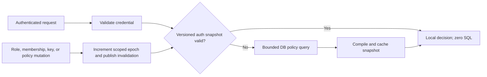

# OutlabsAuth Architecture, Security, and Performance Audit

**Date:** 2026-07-15
**Repository state:** `release/0.1.0a23` at `ab1edfa`
**Audit type:** Design and implementation review; implementation follow-up completed in this hardening change set
**Primary question:** Is poor performance under load caused by the fundamental design or by the current implementation?

## Executive verdict

OutlabsAuth does **not** need a ground-up redesign. Its core authorization model—normalized PostgreSQL data, a closure table for entity hierarchy, explicit RBAC/ABAC policy evaluation, versioned cache invalidation, and separate human/machine authentication modes—is coherent and capable of supporting a robust, flexible system.

The current load problem is primarily an **execution and operational-design problem**, not proof that the underlying authorization model is wrong:

- Warm, Redis-backed API-key authorization completed with **zero SQL queries** and local p95 latency of roughly **3–13 ms** in the audited scenarios.
- The same operations without the authorization cache required **9–16 SQL statements per request** and reached local p95 latency of roughly **35–105 ms**.
- JWT request authentication intentionally performs one database user lookup per request; it measured **1 SQL statement/request**, 3.34 ms median, and 20.63 ms p95 locally at concurrency 10.
- Stateless service-token validation was effectively free at about **0.01 ms** and zero SQL, but achieves that speed by giving up immediate revocation and dynamic permission changes.

The system is therefore best described as **cache-dependent rather than uniformly slow**. Redis is presented as optional, but serious API-key/EnterpriseRBAC load is not viable on the uncached path. That contract should be explicit.

## Hardening follow-up status (2026-07-15)

The P0/P1 runtime controls identified in this audit are implemented and covered by focused unit, integration, migration, and real-Redis regression tests:

| Finding | Implemented control |
|---|---|
| F-01 | Redis counters are atomically staged, PostgreSQL receipts make application idempotent, and staged counters are acknowledged only after commit. |
| F-02 | Typed rate-limit outcomes stop backend fallback and return 429 with `Retry-After`; each request is counted once. |
| F-03 | Redis now requires a deployment prefix and applies it to keys, scans, pipelines, and Pub/Sub channels. |
| F-04 | OAuth state remains signed but is additionally persisted as a one-time record and bound to a Secure, HttpOnly, SameSite cookie. |
| F-05 | Refresh tokens rotate on every use; reuse revokes the user’s active token set. |
| F-06 | Production dependency minimums and lockfile now use current FastAPI, PyJWT, cryptography, and multipart releases; release CI audits the production dependency set. |
| F-07 | Embedded schedulers are disabled by default. `run_background_jobs_once()` and `outlabs-auth run-maintenance` provide explicit worker ownership. |
| F-08 | JWT blacklist and configured API-key quota enforcement default to fail-closed whenever their Redis control is unavailable; both offer explicit fail-open overrides. |
| F-09 | Service tokens use a domain-separated/dedicated signing key, scoped audience/issuer, `jti`, required claims, and a 30-day maximum default lifetime. |

For sustained hot-key workloads, an opt-in one-second process-local validated-snapshot window (`api_key_local_snapshot_cache_ttl=1`) removes repeat Redis version fan-out. It deliberately trades immediate invalidation for bounded per-process staleness and therefore remains disabled by default.

Still operationally required before a production rollout: size pools and Redis connections by total process count, set unique production `jwt_audience`/service-token issuer/key values, and finish the repository-wide type-cleanup baseline. Production dependency audit is now a release gate; the repository-wide type baseline has existing failures and is therefore not yet a release-blocking clean gate.

There are also several concrete correctness and security issues that should block a production release until addressed. The most serious confirmed defect is that the API-key usage worker consumes Redis counters and reports success, but never commits its database transaction. A disposable integration check reported seven uses synced while the persisted count remained zero and the Redis counter had already been deleted.

### Recommended design decision

Keep the relational authorization model and closure-table hierarchy. Redesign the **runtime boundary** around it:

1. Treat the versioned authorization snapshot as the normal production read path.
2. Reduce and bound the database slow path instead of allowing 9–16-query request fan-out.
3. Namespace every Redis key and channel by application/deployment.
4. Move periodic jobs out of each embedded application worker, or give them explicit leader election and durable delivery semantics.
5. Make freshness, availability, and revocation tradeoffs explicit per authentication mode.
6. Split the monolithic feature kernel into clearer identity, authorization, machine-auth, OAuth, and operations modules over time; do not rewrite the policy data model merely to achieve this separation.

## Scope and method

The audit covered:

- architecture, presets, configuration, lifecycle, and middleware;
- JWT, refresh-token, API-key, service-token, and OAuth flows;
- RBAC, context-aware roles, hierarchy, ABAC, and cache invalidation;
- database/Redis failure behavior and multi-process operation;
- unit/integration tests, release CI, static checks, dependency audit, and focused local benchmarks;
- existing June 2026 security/performance audits, checked against current code rather than assumed current.

This was not a formal penetration test, cryptographic proof, production trace analysis, or capacity test against production-sized data. Latencies below are local Docker measurements and are useful for comparing paths, not for predicting production latency.

## Priority findings

| ID | Priority | Finding | Classification | Immediate impact |
|---|---|---|---|---|
| F-01 | P0 | API-key usage sync consumes counters but does not commit DB updates | Implementation defect | Usage and `last_used_at` data are silently lost while the worker reports success |
| F-02 | P0 | API-key rate-limit exceptions fall through authentication | Implementation defect | An over-limit request returns 401 instead of 429, increments twice, performs the DB fallback, and emits exception logs |
| F-03 | P0 | Redis keys, scans, and channels lack an application namespace | Operational design defect | Deployments sharing a Redis DB can consume one another's counters and cause cross-app invalidation/throttling |
| F-04 | P1 | OAuth state is signed but neither browser-bound nor one-time | Security design gap | Login CSRF/session swapping and state replay remain possible |
| F-05 | P1 | Refresh tokens are reusable for their full lifetime | Security design gap | A stolen refresh token can be replayed for up to the default 30 days unless separately revoked |
| F-06 | P1 | The audited environment contains known-vulnerable core dependencies | Release/process defect | Known PyJWT, `python-multipart`, Starlette, and cryptography advisories require exploitability triage and upgrades |
| F-07 | P1 | Every application process owns periodic background jobs | Operational design gap | Multi-worker/replica deployments duplicate work and lack clear job ownership or crash-safe delivery |
| F-08 | P1 | Redis loss silently changes important security behavior | Security/availability tradeoff | API-key rate limiting and JWT blacklist enforcement fail open; authorization caching falls back to expensive DB work |
| F-09 | P2 | Service tokens are long-lived, stateless, and share the main signing key | Intentional design tradeoff | Very fast validation, but broad blast radius and no immediate revocation or permission update |
| F-10 | P2 | Quality/security/performance gates are incomplete | Process weakness | Strong runtime tests coexist with unenforced types/formatting, stale docs, no dependency gate, and no sustained load gate |

P0 means fix before production release. P1 means schedule immediately after the release blockers or include it in the same hardening release. P2 is important hardening and maintainability work.

## Detailed findings

### F-01 — API-key usage counters are silently lost

The worker opens an `AsyncSession`, executes the synchronization, and exits the context without calling `commit()` ([worker source](../outlabs_auth/workers/api_key_sync.py#L160)). The service atomically consumes counters via `GETDEL`, executes the database `UPDATE`, and returns success ([service source](../outlabs_auth/services/api_key.py#L681)). Exiting an `AsyncSession` context does not commit the transaction.

Focused disposable verification:

```text
sync_stats:              {synced_keys: 1, total_usage: 7, errors: 0}
persisted_usage_count:   0
redis_counter_after_sync: absent
```

This is worse than stale analytics: the system asserts successful persistence after permanently discarding the source data.

Even after adding the missing commit, the current consume-before-commit design still has a loss window: a process or database failure after `GETDEL` but before commit loses the batch. A robust implementation needs acknowledgment semantics, such as moving counters atomically to a processing namespace, committing the database transaction, and only then acknowledging/deleting the staged batch. A Redis Stream or durable queue is another reasonable design.

Required acceptance tests:

- a successful worker cycle persists the exact delta in a fresh database session;
- a database failure leaves the delta recoverable for retry;
- two concurrent workers neither duplicate nor lose a delta;
- a process crash at each transition is recoverable;
- counters from another application namespace cannot be observed or consumed.

### F-02 — Rate limiting amplifies over-limit requests instead of terminating them

The cached API-key path increments the usage/rate counters and raises `InvalidInputError` when over limit. The dependency catches that exception and returns `None` ([dependency source](../outlabs_auth/dependencies/__init__.py#L217)), causing authentication to continue on the full database path. The API-key strategy then increments the rate counter again, catches every exception, logs a stack trace, and returns `None` ([strategy source](../outlabs_auth/authentication/strategy.py#L342)). The caller ultimately receives a generic 401.

Focused disposable verification with a one-request/minute key:

```text
request statuses:   [200, 401]
Redis rate counter: 3
```

The second request should have produced 429 and a counter of 2. Instead it was counted twice, performed unnecessary database work, and generated exception logging. Under abusive or accidental excess load, the rate limiter therefore creates extra work and noisy logs rather than protecting the backend.

The fix should use a typed rate-limit outcome that stops backend fallback, returns 429 with retry metadata, increments exactly once, and is logged as an expected policy event rather than an exception. Rate-limit behavior should also be tested through the actual FastAPI dependency, not only at service-method level.

### F-03 — Redis is not isolated between applications

`RedisClient.make_key()` simply joins parts with `:` ([source](../outlabs_auth/services/redis_client.py#L784)). API-key counters use global patterns such as `apikey:*:usage` ([source](../outlabs_auth/services/api_key.py#L685)), and the worker consumes every match before checking whether the IDs exist in its own database.

This was observed during the audit: running isolated benchmark schemas against one Redis database produced repeated `API key not found for counter` warnings. Each auth instance's worker scanned and consumed counters created by another instance, then discarded them because those UUIDs were absent from its database.

The same missing namespace affects:

- API-key usage, last-used, and rate-limit keys;
- permission/API-key snapshots and version counters;
- cache invalidation pub/sub;
- token blacklist entries;
- passwordless and email-address rate limits.

Random UUIDs make direct authorization-data leakage unlikely, but cross-application counter loss, shared throttling, global cache churn, and denial-of-service coupling are real. A required `redis_key_prefix`/application identifier should cover **every key, pattern, script, and channel**. Until then, the deployment guide should require a dedicated Redis database or instance per OutlabsAuth application.

### F-04 — OAuth state is not sufficient login-CSRF protection

The authorize route creates an empty signed state payload ([router source](../outlabs_auth/routers/oauth.py#L126)). The callback validates only signature, audience, and time; it does not bind the state to the initiating browser/session and does not consume it once ([callback source](../outlabs_auth/routers/oauth.py#L181)). An attacker can initiate an OAuth flow and potentially cause another browser to complete the attacker's callback, producing login/session swapping.

Use a high-entropy state value bound to an HttpOnly, Secure, SameSite cookie or server-side login transaction, validate an exact match at callback, and consume it atomically. If PKCE is available for the provider/client type, use it as an additional control. State should remain short lived but short expiry alone does not make it browser-bound or one-time.

The decoder also uses PyJWT option names `require_exp` and `require_iat`, which are not the supported `require: ["exp", "iat"]` form ([state decoder](../outlabs_auth/oauth/state.py#L136)). Empirical checks confirmed that specially created state tokens missing either claim were accepted. Legitimate generated states currently include both claims, so this is defense-in-depth rather than the primary OAuth issue, but the code's stated guarantee is false.

### F-05 — Refresh-token replay window is too large for a robust default

The refresh flow validates the stored token, creates a new access token, records usage, and returns the **same refresh token** ([source](../outlabs_auth/services/auth.py#L515)). A stolen token can be replayed repeatedly for the default 30-day lifetime unless the user logs out, changes password, or an administrator revokes it.

For public clients, [OAuth 2.0 Security Best Current Practice, RFC 9700](https://www.rfc-editor.org/rfc/rfc9700.html#section-4.14.2) calls for sender-constrained refresh tokens or refresh-token rotation to detect replay. OutlabsAuth should rotate on every use, revoke the prior token atomically, maintain a token family, and revoke the family when reuse is detected. This is compatible with the existing stored-token model.

### F-06 — Known-vulnerable dependencies are present and not gated

`pip-audit` against the installed environment found 88 advisory records in 16 packages. That total includes duplicates and optional/development packages and must not be read as 88 exploitable OutlabsAuth vulnerabilities. However, security-relevant packages on core request paths were behind available fixes:

| Package | Audited version | Examples of reported fixed versions |
|---|---:|---:|
| PyJWT | 2.10.1 | 2.12.0–2.13.0, depending on advisory |
| `python-multipart` | 0.0.20 | 0.0.22–0.0.31 |
| Starlette | 0.48.0 | 0.49.1 and later, depending on advisory |
| cryptography | 46.0.2 | 46.0.5–48.0.1, depending on advisory |

The project uses broad lower bounds, including `pyjwt>=2.8.0` and `python-multipart>=0.0.18` ([project metadata](../pyproject.toml#L27)). Broad compatibility bounds are normal for a library, but the tested lock/release environment must be current and supported. Triage each advisory against the exact algorithms and routes OutlabsAuth exposes, update the lock and any unsafe minimums, and add a dependency-audit job that fails according to a documented severity/exploitability policy.

### F-07 — Background work has no single owner

Initialization starts token cleanup, activity synchronization, and API-key usage synchronization inside the library instance. A typical Gunicorn/Uvicorn multi-worker or multi-replica deployment therefore starts one copy per process. The API-key worker's atomic collection limits duplicate counting, but it does not solve redundant scans, the data-loss window, or cross-application consumption. Other jobs can also duplicate work.

This is a structural mismatch between an embedded library and distributed job ownership. Prefer one of:

- an explicit OutlabsAuth worker/CLI process with durable job semantics;
- host-provided scheduling where the application owns job lifecycle;
- database/Redis leader election with fencing and idempotent jobs.

Starting periodic jobs automatically inside every web process should not be the production default.

### F-08 — Redis failure modes are inconsistent and partly fail open

Redis currently participates in several different contracts:

| Feature | Behavior when Redis is unavailable | Assessment |
|---|---|---|
| Permission/API-key authorization cache | Falls back to PostgreSQL | Correctness-safe, but can create a database load cliff |
| API-key usage | Writes directly to DB on the cold path | More expensive but retains usage for that path |
| API-key rate limits | Not enforced on DB fallback | Fails open |
| JWT access-token blacklist | Skipped | Fails open until token expiry (15 minutes by default) |
| Passwordless request limits | Can fall back to process-local counters | Limit multiplies with worker count and resets on restart |

These are legitimate availability/security tradeoffs, but they are not one coherent policy. Make behavior configurable per control (`fail_closed`, `fail_open_with_alert`, or `degrade_to_local`) and emit high-signal health/metrics when protection is degraded. Capacity planning must assume a cache-outage fallback and prevent a thundering herd from exhausting the database pool.

### F-09 — Service-token speed is purchased with a large security tradeoff

Service tokens embed permissions, default to a 365-day lifetime, use a fixed `outlabs-auth:service` audience, and are signed with the same application secret as user tokens ([source](../outlabs_auth/services/service_token.py#L53)). They have no `jti`, registry, family, issuer, key ID, or revocation lookup.

This is why they validate with zero I/O, so the design is not inherently wrong. It should be a deliberately restricted mode, not a general machine-identity default. Recommended controls:

- separate signing keys and explicit issuer/audience per application/environment;
- key IDs and documented rotation overlap;
- materially shorter default lifetimes;
- least-privilege scopes and a narrow allowlist of intended use cases;
- integration-principal API keys for workloads that need immediate revocation or dynamic permissions.

The main JWT audience also defaults to generic `outlabs-auth` despite being described as cross-application protection. If operators reuse a signing secret, tokens are portable between apps. Production configuration should require an application-specific audience and issuer.

### F-10 — Verification is strong in places but incomplete as a release gate

The repository has a substantial automated suite and the release workflow correctly runs PostgreSQL and Redis together. It also runs a black-box EnterpriseRBAC API integration job. These are meaningful strengths.

Gaps found during the audit:

- Ruff passes, but only a narrow set of fatal/correctness rules (`E9`, `F63`, `F7`, `F82`) is enabled.
- Black check fails on eight example/benchmark files.
- MyPy reports 22 errors across eight library files and is not enforced in CI.
- No dependency audit is enforced.
- Existing performance tests mostly enforce query budgets; there is no sustained throughput, p95/p99, cache-outage, multi-replica, or large-policy-graph release gate.
- The benchmark harness reuses keys across scenarios and can hit the default 60/minute limit, producing false performance failures unless iteration counts are adjusted or rate limiting is disabled.
- The benchmark suite did not cover the JWT FastAPI dependency before this audit.
- Large parts of the deployment, security, testing, and design documentation still describe MongoDB/Beanie even though the current library is PostgreSQL-only. This is an operational safety issue, not merely cosmetic documentation debt.

## Performance analysis

### Measured local request costs

All API-key scenarios below completed successfully in the clean 20-request run at concurrency 10. `off` means Redis authorization caching was disabled. `cache` means a warmed Redis authorization snapshot. The benchmark used isolated disposable PostgreSQL schemas.

| Scenario | Cache | SQL/request | p95 ms |
|---|---|---:|---:|
| Simple personal API key, direct authorization | off | 9 | 70.73 |
| Simple personal API key, direct authorization | cache | 0 | 6.99 |
| Simple personal API key, FastAPI permission dependency | off | 10 | 60.50 |
| Simple personal API key, FastAPI permission dependency | cache | 0 | 3.27 |
| Enterprise personal key, unanchored direct | off | 12 | 105.36 |
| Enterprise personal key, unanchored direct | cache | 0 | 12.67 |
| Enterprise personal key, dependency | off | 13 | 82.50 |
| Enterprise personal key, dependency | cache | 0 | 3.69 |
| Enterprise personal key, anchored tree | off | 16 | 70.84 |
| Enterprise personal key, anchored tree | cache | 0 | 3.11 |
| Enterprise system key, global | off | 9 | 35.31 |
| Enterprise system key, global | cache | 0 | 3.25 |
| Enterprise system key, entity tree | off | 11 | 38.92 |
| Enterprise system key, entity tree | cache | 0 | 3.10 |
| JWT `require_auth`, 100 requests | n/a | 1 | 20.63 |
| Stateless service-token permission check | n/a | 0 | ~0.01 |

These results show three distinct performance classes:

1. **Stateless token:** near-zero overhead, bounded only by local cryptographic/permission checks, but stale until expiry.
2. **Versioned shared snapshot:** low-millisecond, zero-SQL request path with immediate invalidation dependent on Redis availability.
3. **Relational reconstruction:** 9–16 SQL statements and high sensitivity to database latency, pool contention, policy shape, and concurrency.

### What is fundamental

- Context-aware roles, direct roles, entity memberships, hierarchy inheritance, API-key scope intersections, and optional ABAC create a real policy graph. Reconstructing that graph will cost more than flat RBAC.
- Immediate reaction to user disablement, password change, key revocation, or role changes requires consulting some mutable trusted state. A completely stateless request cannot also guarantee immediate revocation.
- Closure tables optimize ancestor/descendant reads by paying complexity and write cost when the hierarchy changes.
- A general-purpose library with many authentication modes necessarily has more configuration and attack surface than an application-specific auth module.

### What is implementation/deployment

- A Boolean authorization answer should not require 9–16 database statements on a normal request path.
- Redis is operationally mandatory for high-load API keys but described as optional.
- Rate-limit fallback repeats work and turns 429 into 401.
- Counter synchronization is not transactional/durable.
- Redis data is not application-scoped.
- Background job ownership is implicit and duplicated.
- The default database pool (5 persistent + 10 overflow) and hard-coded Redis maximum of 50 connections may be wrong for a given worker topology; multiplying each by process count can also exceed backend capacity.
- `db_pool_pre_ping=True` improves resilience but adds checkout overhead on unstable/remote connection paths. It should be benchmarked with the real network and pooling topology.

### Performance conclusion

Poor load performance is **mostly fixable without replacing the authorization data model**. The correct target is a predictable two-tier engine:



The database slow path remains essential, but it should be bounded, observable, protected against stampedes, and uncommon in a healthy production deployment.

An in-process snapshot cache can further reduce Redis latency for very hot keys, but it is not a general replacement for Redis in multi-process deployments. Its TTL is also an explicit maximum revocation delay.

## Architecture assessment

### Strong decisions worth retaining

- PostgreSQL transactions for identity, membership, policy, and audit mutations.
- Closure-table hierarchy rather than recursive per-request traversal.
- Explicit permission names and operator-based ABAC rather than dynamic code evaluation.
- Owner/role containment checks and entity isolation in the current hardening tests.
- Argon2 password hashing with configurable parameters and off-main-loop hashing.
- SHA-256 lookup for high-entropy API keys rather than password hashing every key request.
- Short access-token default and database user-state validation for human JWTs.
- Version counters plus pub/sub invalidation rather than delete-by-pattern alone.
- Request-scoped unit-of-work and request-level authentication memoization.
- Separate simple and enterprise presets as product concepts.

### Design pressure that needs containment

The “simple” preset changes feature behavior but still initializes a large, tightly connected kernel. The five main auth/permission/dependency modules total more than 9,400 lines. Optional machine auth, OAuth, notification, audit, hierarchy, and policy concerns share lifecycle and configuration. That increases review cost, makes failure domains harder to reason about, and allows feature flags to interact in ways that unit tests may not cover.

Over time, define explicit internal boundaries:

- **Identity/session core:** users, credentials, access/refresh lifecycle, lockout.
- **Authorization engine:** roles, permissions, memberships, hierarchy, ABAC, compiled snapshots.
- **Machine identity:** integration principals, API keys, service tokens.
- **Federation:** OAuth providers, browser-bound transactions, account linking.
- **Operations:** cache transport, invalidation, audit/event delivery, periodic jobs, metrics.

This can be done incrementally while preserving public APIs. The goal is clear ownership and independently testable failure behavior, not microservices for their own sake.

## Recommended remediation sequence

### P0 — before production release

1. **Make API-key usage persistence lossless.** Add the missing commit, then replace consume-before-commit with a staged/acknowledged design and crash/concurrency tests.
2. **Terminate rate-limited authentication correctly.** Return 429, increment once, stop backend fallback, and avoid exception-level logging for expected limits.
3. **Add an application namespace to all Redis keys/channels/patterns.** Document a dedicated Redis DB as the temporary operational requirement.
4. **Triage and upgrade vulnerable dependencies.** Refresh the tested lock, raise unsafe floors where necessary, and add a dependency-audit CI policy.

### P1 — security and distributed-runtime hardening

5. Bind OAuth state to the initiating browser and consume it once; fix required-claim validation and add login-CSRF/replay tests.
6. Implement refresh-token rotation, token families, and reuse detection.
7. Move scheduled work to an explicitly owned worker or add leader election, fencing, idempotency, and durable retry.
8. Define Redis-degraded behavior for every security control, expose health signals, and load-test Redis loss/recovery.
9. Reduce cold API-key authorization to a bounded query plan or compiled database representation; add request coalescing to prevent cache stampedes.
10. Make application-specific JWT issuer/audience mandatory in production and separate service-token signing/rotation.

### P2 — maintainability and performance confidence

11. Add production-shape load tests: p50/p95/p99, throughput, pool wait, Redis/DB time, cache hit ratio, cold-start storms, large role/membership graphs, and multiple replicas.
12. Decide and document the JWT freshness contract. If one database read/request is too expensive, use a small versioned security snapshot while explicitly accepting bounded staleness.
13. Enforce formatting, a practical type-checking baseline, broader lint/security rules, and benchmark correctness in CI.
14. Replace or clearly archive MongoDB-era documentation and establish one current architecture/deployment source of truth.
15. Modularize internal lifecycle and configuration boundaries while keeping the proven relational model.

## Suggested production acceptance criteria

The exact latency numbers must be calibrated on production-like infrastructure, but release gates should include:

- warm authorization paths perform zero SQL and remain within an agreed p95/p99 SLO;
- cold paths have an explicit maximum query count and do not scale linearly with unrelated users/roles;
- over-limit API keys return 429, increment once, and perform no DB fallback;
- API-key usage survives DB failure, worker crash, concurrent workers, and restart without loss or duplication;
- two applications sharing a Redis instance cannot see, consume, throttle, blacklist, or invalidate one another;
- cache loss causes a controlled degradation, not database saturation;
- role/key/user revocations meet a documented propagation bound in every cache tier;
- refresh-token reuse revokes the token family;
- OAuth callback state cannot be replayed or completed from a different browser transaction;
- dependency audit, full Postgres+Redis suite, formatting, linting, and the agreed type baseline all pass.

## Verification performed

| Check | Result |
|---|---|
| Unit suite | 573 passed, 7 skipped |
| Integration suite | 324 passed, 3 Redis hot-path tests initially skipped because the local Redis required authentication |
| Redis hot-path tests with the correct local URL | 3 passed |
| Ruff | Passed under the repository's narrow configured rule set |
| Black check | Failed; 8 example/benchmark files would be reformatted |
| MyPy on `outlabs_auth` | Failed; 22 errors in 8 files |
| Release version metadata/CLI | Passed; `0.1.0a23` consistent |
| Dependency audit | 88 advisory records in 16 installed packages; includes optional/dev packages and duplicates, but core packages require action |
| Focused API-key benchmark | Confirmed 9–16 SQL cold vs 0 SQL warm |
| Focused JWT benchmark | 100/100 successful; 1 SQL/request; 3.34 ms median; 20.63 ms p95 at concurrency 10 |
| Usage-worker transaction probe | Confirmed reported success + deleted Redis counter + no persisted DB increment |
| Rate-limit dependency probe | Confirmed `[200, 401]` and counter `3` for a limit of one |
| OAuth required-claim probe | Confirmed missing `exp` and missing `iat` tokens were accepted by the decoder |

## Final assessment

OutlabsAuth has the bones of a strong system, and the recent hardening work is visible in its tests, token-type validation, role containment, hierarchy handling, cache versions, and request memoization. Its main risk is that the product promise—robust and flexible—currently exceeds the runtime contract: correctness and speed depend on Redis, but Redis isolation, degraded behavior, and background delivery are not yet production-grade.

The best course is **not** to simplify away the enterprise model or replace PostgreSQL. Fix the P0 defects, formalize Redis and job ownership as part of the production architecture, then optimize the bounded cold path and modularize the implementation. That would preserve flexibility while making performance and security behavior predictable under load and failure.
