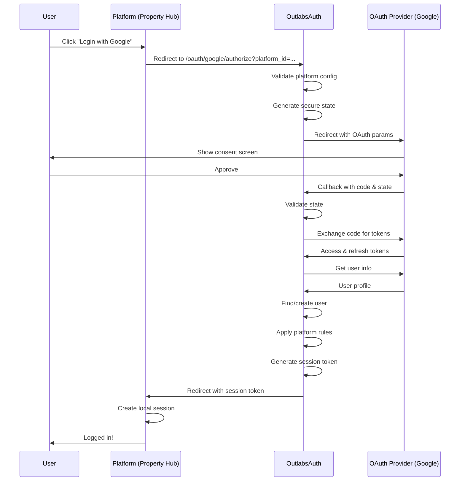

# Centralized OAuth Guide

This guide outlines how OutlabsAuth should implement centralized OAuth/SSO to provide a complete auth-as-a-service solution, similar to Supabase, Auth0, or Firebase Auth. This approach eliminates the need for each platform to manage its own OAuth integrations.

## Table of Contents

1. [Overview](#overview)
2. [Architecture](#architecture)
3. [Multi-Tenant OAuth Design](#multi-tenant-oauth-design)
4. [Implementation Requirements](#implementation-requirements)
5. [OAuth Flow](#oauth-flow)
6. [Provider Configuration](#provider-configuration)
7. [Platform Integration](#platform-integration)
8. [Security Considerations](#security-considerations)
9. [Migration Path](#migration-path)
10. [Comparison with Other Solutions](#comparison-with-other-solutions)

## Overview

### Vision

OutlabsAuth becomes a complete authentication service where platforms can enable OAuth providers with simple configuration, without managing OAuth apps, callbacks, or provider-specific logic.

### Benefits

1. **Simplified Integration**: Platforms just redirect to OutlabsAuth OAuth endpoints
2. **Centralized Management**: One OAuth app per provider for all platforms
3. **Consistent Experience**: Same OAuth flow across all platforms
4. **Reduced Complexity**: No OAuth implementation needed at platform level
5. **Provider Updates**: OAuth provider changes handled centrally
6. **Better Security**: OAuth secrets managed in one secure location

### Architecture Overview

```
┌─────────────┐     ┌──────────────┐     ┌──────────────┐     ┌─────────────┐
│Platform User│────▶│Platform (e.g.│────▶│ OutlabsAuth  │────▶│OAuth Provider│
│             │     │Property Hub) │     │ OAuth Service│     │  (Google)   │
└─────────────┘     └──────────────┘     └──────────────┘     └─────────────┘
                           │                      │
                           │                      │
                    Session Cookie          JWT + Platform
                                              Context
```

## Architecture

### Components

1. **OAuth Service**: Centralized service in OutlabsAuth handling all OAuth flows
2. **Provider Registry**: Configuration for all supported OAuth providers
3. **Platform Configuration**: Per-platform OAuth settings and permissions
4. **Callback Router**: Dynamic routing based on platform and provider
5. **Session Exchange**: Convert OAuth success to platform session tokens

### Database Schema

```python
# OAuth provider configuration
class OAuthProvider(Document):
    name: str  # google, github, microsoft, etc.
    display_name: str
    client_id: str
    client_secret_encrypted: str
    authorization_url: str
    token_url: str
    userinfo_url: str
    scopes: List[str]
    icon_url: Optional[str]
    is_active: bool = True
    created_at: datetime
    updated_at: datetime

# Platform OAuth configuration
class PlatformOAuthConfig(Document):
    platform_id: str
    provider: str  # google, github, etc.
    enabled: bool = True
    allowed_domains: Optional[List[str]]  # Email domain restrictions
    required_scopes: Optional[List[str]]  # Additional scopes
    auto_create_users: bool = True
    default_role_id: Optional[str]
    default_entity_id: Optional[str]
    metadata_mapping: Dict[str, str]  # Map OAuth fields to user metadata
    created_at: datetime
    updated_at: datetime

# OAuth state tracking
class OAuthState(Document):
    state: str  # Random state parameter
    platform_id: str
    provider: str
    redirect_uri: str  # Platform's redirect URI
    code_challenge: Optional[str]  # For PKCE
    created_at: datetime
    expires_at: datetime  # Short-lived (10 minutes)
    ip_address: str
    user_agent: str
```

## Multi-Tenant OAuth Design

### Dynamic Callback URLs

Instead of registering multiple callback URLs with OAuth providers, use a single pattern:

```
https://auth.outlabs.com/oauth/callback/{provider}
```

The platform context is maintained through the state parameter.

### State Parameter Structure

```javascript
// Encoded state parameter contains:
{
  "platform_id": "plat_property_hub",
  "redirect_uri": "https://propertyhub.com/auth/callback",
  "nonce": "random-nonce",
  "timestamp": 1234567890,
  "session_id": "optional-session-for-linking"
}

// Signed and encrypted for security
const state = encrypt(sign(stateData));
```

### Platform Isolation

Each platform's OAuth configuration is completely isolated:

```python
# Platform A can use Google with specific settings
PlatformOAuthConfig(
    platform_id="plat_property_hub",
    provider="google",
    allowed_domains=["propertyhub.com", "realestate.com"],
    auto_create_users=True
)

# Platform B might restrict Google to company domain
PlatformOAuthConfig(
    platform_id="plat_corporate",
    provider="google", 
    allowed_domains=["company.com"],
    required_scopes=["calendar.readonly"],
    auto_create_users=False
)
```

## Implementation Requirements

### 1. OAuth Service Implementation

```python
# api/services/oauth_service.py
class OAuthService:
    def __init__(self):
        self.providers = {}
        self.load_providers()
    
    async def initiate_oauth(
        self,
        platform_id: str,
        provider: str,
        redirect_uri: str,
        state_data: dict = None
    ) -> str:
        """Generate OAuth authorization URL"""
        
        # Validate platform can use this provider
        config = await self.get_platform_oauth_config(platform_id, provider)
        if not config or not config.enabled:
            raise ValueError(f"OAuth provider {provider} not enabled for platform")
        
        # Get provider configuration
        provider_config = self.providers.get(provider)
        if not provider_config:
            raise ValueError(f"Unknown OAuth provider: {provider}")
        
        # Generate secure state
        state = await self.create_oauth_state(
            platform_id=platform_id,
            provider=provider,
            redirect_uri=redirect_uri,
            additional_data=state_data
        )
        
        # Build authorization URL
        params = {
            'client_id': provider_config.client_id,
            'redirect_uri': f"{settings.OAUTH_CALLBACK_BASE}/oauth/callback/{provider}",
            'response_type': 'code',
            'scope': ' '.join(provider_config.scopes + (config.required_scopes or [])),
            'state': state,
            'access_type': 'offline',  # For refresh tokens
            'prompt': 'consent'  # Ensure we get refresh token
        }
        
        # Add provider-specific parameters
        if provider == 'google':
            params['include_granted_scopes'] = 'true'
        elif provider == 'github':
            params['allow_signup'] = 'true'
        
        auth_url = f"{provider_config.authorization_url}?{urlencode(params)}"
        return auth_url
    
    async def handle_callback(
        self,
        provider: str,
        code: str,
        state: str,
        error: str = None
    ) -> dict:
        """Handle OAuth callback"""
        
        if error:
            raise OAuthError(f"OAuth error: {error}")
        
        # Validate and decode state
        state_data = await self.validate_oauth_state(state)
        platform_id = state_data['platform_id']
        
        # Exchange code for tokens
        tokens = await self.exchange_code_for_tokens(provider, code)
        
        # Get user info from provider
        oauth_user = await self.get_oauth_user_info(provider, tokens['access_token'])
        
        # Get platform configuration
        platform_config = await self.get_platform_oauth_config(platform_id, provider)
        
        # Validate user against platform rules
        await self.validate_oauth_user(oauth_user, platform_config)
        
        # Find or create user
        user = await self.find_or_create_user(
            platform_id=platform_id,
            provider=provider,
            oauth_user=oauth_user,
            platform_config=platform_config
        )
        
        # Generate session token for platform
        session_token = await self.create_platform_session_token(
            user=user,
            platform_id=platform_id,
            auth_method=f'oauth_{provider}'
        )
        
        return {
            'user': user,
            'session_token': session_token,
            'redirect_uri': state_data['redirect_uri']
        }
```

### 2. OAuth Routes

```python
# api/routes/oauth_routes.py
from fastapi import APIRouter, Query, HTTPException
from fastapi.responses import RedirectResponse

router = APIRouter()
oauth_service = OAuthService()

@router.get("/oauth/{provider}/authorize")
async def oauth_authorize(
    provider: str,
    platform_id: str = Query(..., description="Platform ID"),
    redirect_uri: str = Query(..., description="Platform redirect URI"),
    state: Optional[str] = Query(None, description="Additional state data")
):
    """
    Initiate OAuth flow for a platform
    
    Example:
    GET /oauth/google/authorize?platform_id=plat_property_hub&redirect_uri=https://propertyhub.com/auth/callback
    """
    try:
        auth_url = await oauth_service.initiate_oauth(
            platform_id=platform_id,
            provider=provider,
            redirect_uri=redirect_uri,
            state_data={"custom": state} if state else None
        )
        
        return RedirectResponse(url=auth_url)
        
    except ValueError as e:
        raise HTTPException(status_code=400, detail=str(e))

@router.get("/oauth/callback/{provider}")
async def oauth_callback(
    provider: str,
    code: Optional[str] = Query(None),
    state: str = Query(...),
    error: Optional[str] = Query(None),
    error_description: Optional[str] = Query(None)
):
    """
    Handle OAuth provider callback
    
    This endpoint is registered with all OAuth providers
    """
    try:
        result = await oauth_service.handle_callback(
            provider=provider,
            code=code,
            state=state,
            error=error
        )
        
        # Redirect back to platform with session token
        platform_redirect = f"{result['redirect_uri']}?token={result['session_token']}"
        
        # Add user info if platform requests it
        if result.get('include_user_info'):
            platform_redirect += f"&user={encode_user_info(result['user'])}"
        
        return RedirectResponse(url=platform_redirect)
        
    except OAuthError as e:
        # Redirect to platform with error
        state_data = await oauth_service.decode_state(state)
        error_redirect = f"{state_data['redirect_uri']}?error=oauth_failed&message={str(e)}"
        return RedirectResponse(url=error_redirect)

@router.post("/oauth/platform/configure")
async def configure_platform_oauth(
    platform_id: str,
    provider: str,
    config: PlatformOAuthConfigCreate,
    current_user: User = Depends(require_platform_admin)
):
    """
    Configure OAuth settings for a platform
    """
    oauth_config = await oauth_service.configure_platform_oauth(
        platform_id=platform_id,
        provider=provider,
        config=config
    )
    
    return oauth_config

@router.get("/oauth/providers")
async def list_oauth_providers(
    platform_id: Optional[str] = Query(None)
):
    """
    List available OAuth providers
    
    If platform_id is provided, includes platform-specific configuration
    """
    providers = await oauth_service.list_providers(platform_id)
    return {"providers": providers}
```

### 3. Provider Implementations

```python
# api/services/oauth_providers/google.py
class GoogleOAuthProvider(BaseOAuthProvider):
    def __init__(self):
        super().__init__(
            name="google",
            authorization_url="https://accounts.google.com/o/oauth2/v2/auth",
            token_url="https://oauth2.googleapis.com/token",
            userinfo_url="https://www.googleapis.com/oauth2/v2/userinfo"
        )
    
    async def get_user_info(self, access_token: str) -> dict:
        """Get user info from Google"""
        response = await self.http_client.get(
            self.userinfo_url,
            headers={"Authorization": f"Bearer {access_token}"}
        )
        
        data = response.json()
        
        # Normalize to standard format
        return {
            "id": data["id"],
            "email": data["email"],
            "email_verified": data.get("verified_email", False),
            "name": data.get("name"),
            "given_name": data.get("given_name"),
            "family_name": data.get("family_name"),
            "picture": data.get("picture"),
            "locale": data.get("locale"),
            "raw": data  # Keep original data
        }
    
    def get_scopes(self) -> List[str]:
        """Default scopes for Google"""
        return ["openid", "email", "profile"]

# api/services/oauth_providers/github.py
class GitHubOAuthProvider(BaseOAuthProvider):
    def __init__(self):
        super().__init__(
            name="github",
            authorization_url="https://github.com/login/oauth/authorize",
            token_url="https://github.com/login/oauth/access_token",
            userinfo_url="https://api.github.com/user"
        )
    
    async def get_user_info(self, access_token: str) -> dict:
        """Get user info from GitHub"""
        # Get basic user info
        response = await self.http_client.get(
            self.userinfo_url,
            headers={
                "Authorization": f"Bearer {access_token}",
                "Accept": "application/vnd.github.v3+json"
            }
        )
        
        user_data = response.json()
        
        # Get primary email if not public
        email = user_data.get("email")
        if not email:
            email_response = await self.http_client.get(
                "https://api.github.com/user/emails",
                headers={
                    "Authorization": f"Bearer {access_token}",
                    "Accept": "application/vnd.github.v3+json"
                }
            )
            emails = email_response.json()
            primary_email = next((e for e in emails if e["primary"]), None)
            email = primary_email["email"] if primary_email else None
        
        # Normalize to standard format
        names = (user_data.get("name") or "").split(" ", 1)
        return {
            "id": str(user_data["id"]),
            "email": email,
            "email_verified": True,  # GitHub verifies emails
            "name": user_data.get("name"),
            "given_name": names[0] if names else user_data.get("login"),
            "family_name": names[1] if len(names) > 1 else "",
            "picture": user_data.get("avatar_url"),
            "username": user_data.get("login"),
            "profile_url": user_data.get("html_url"),
            "company": user_data.get("company"),
            "location": user_data.get("location"),
            "raw": user_data
        }
```

## OAuth Flow

### Complete Flow Diagram



### Detailed Flow Steps

1. **Platform Initiates OAuth**
```javascript
// Property Hub frontend
function loginWithGoogle() {
  window.location.href = 
    'https://auth.outlabs.com/oauth/google/authorize?' +
    'platform_id=plat_property_hub&' +
    'redirect_uri=' + encodeURIComponent('https://propertyhub.com/auth/callback');
}
```

2. **OutlabsAuth Prepares OAuth**
```python
# OutlabsAuth validates and redirects to Google
auth_url = "https://accounts.google.com/o/oauth2/v2/auth?" + urlencode({
    "client_id": GOOGLE_CLIENT_ID,
    "redirect_uri": "https://auth.outlabs.com/oauth/callback/google",
    "response_type": "code",
    "scope": "openid email profile",
    "state": encrypted_state_with_platform_context
})
```

3. **Handle OAuth Callback**
```python
# OutlabsAuth processes Google callback
async def handle_google_callback(code, state):
    # Decrypt state to get platform context
    state_data = decrypt_and_validate_state(state)
    
    # Exchange code for tokens
    tokens = await exchange_code_for_tokens(code)
    
    # Get user info
    google_user = await get_google_user_info(tokens.access_token)
    
    # Find or create user with platform context
    user = await find_or_create_user(
        email=google_user.email,
        provider="google",
        provider_id=google_user.id,
        platform_id=state_data.platform_id
    )
    
    # Create session token
    session_token = create_session_token(
        user_id=user.id,
        platform_id=state_data.platform_id,
        auth_method="oauth_google"
    )
    
    # Redirect back to platform
    return redirect(f"{state_data.redirect_uri}?token={session_token}")
```

4. **Platform Handles Return**
```javascript
// Property Hub callback handler
async function handleOAuthCallback() {
  const params = new URLSearchParams(window.location.search);
  const token = params.get('token');
  const error = params.get('error');
  
  if (error) {
    showError('OAuth login failed: ' + params.get('message'));
    return;
  }
  
  if (token) {
    // Exchange session token for platform session
    const response = await fetch('/api/auth/oauth/complete', {
      method: 'POST',
      headers: { 'Content-Type': 'application/json' },
      body: JSON.stringify({ session_token: token })
    });
    
    const { user, session } = await response.json();
    
    // Create platform session
    setSession(session);
    redirectToDashboard();
  }
}
```

## Provider Configuration

### Admin UI for Provider Management

```python
# Platform admin can configure OAuth providers
@router.put("/platforms/{platform_id}/oauth/{provider}")
async def update_platform_oauth_config(
    platform_id: str,
    provider: str,
    config: PlatformOAuthConfigUpdate,
    current_user: User = Depends(require_platform_admin)
):
    """
    Update OAuth configuration for a platform
    
    Example request:
    {
        "enabled": true,
        "allowed_domains": ["company.com", "partner.com"],
        "auto_create_users": true,
        "default_role_id": "role_basic_user",
        "default_entity_id": "ent_default_org",
        "metadata_mapping": {
            "department": "oauth.company_department",
            "employee_id": "oauth.employee_number"
        }
    }
    """
    updated_config = await oauth_service.update_platform_config(
        platform_id=platform_id,
        provider=provider,
        config=config
    )
    
    return updated_config
```

### Provider-Specific Settings

```python
# Different providers may have different configuration options
class GooglePlatformConfig(PlatformOAuthConfig):
    # Google-specific settings
    hosted_domain: Optional[str]  # Restrict to G Suite domain
    access_type: str = "offline"  # For refresh tokens
    include_granted_scopes: bool = True
    
class GitHubPlatformConfig(PlatformOAuthConfig):
    # GitHub-specific settings
    required_organizations: Optional[List[str]]
    required_teams: Optional[List[str]]
    
class MicrosoftPlatformConfig(PlatformOAuthConfig):
    # Microsoft-specific settings
    tenant: str = "common"  # or specific tenant ID
    resource: Optional[str]  # For specific resources
```

## Platform Integration

### Simple Integration Example

```javascript
// Property Hub integration - minimal code needed
class OutlabsAuthIntegration {
  constructor(config) {
    this.authBaseUrl = 'https://auth.outlabs.com';
    this.platformId = config.platformId;
    this.apiKey = config.apiKey;
  }
  
  // Redirect to OAuth provider
  loginWithProvider(provider) {
    const params = new URLSearchParams({
      platform_id: this.platformId,
      redirect_uri: window.location.origin + '/auth/callback'
    });
    
    window.location.href = 
      `${this.authBaseUrl}/oauth/${provider}/authorize?${params}`;
  }
  
  // Handle OAuth callback
  async handleCallback() {
    const params = new URLSearchParams(window.location.search);
    const token = params.get('token');
    
    if (!token) {
      throw new Error(params.get('message') || 'OAuth failed');
    }
    
    // Exchange for platform session
    const response = await fetch('/api/auth/session', {
      method: 'POST',
      headers: {
        'Content-Type': 'application/json',
        'X-API-Key': this.apiKey
      },
      body: JSON.stringify({ 
        outlabs_session_token: token 
      })
    });
    
    return response.json();
  }
  
  // List available providers for this platform
  async getAvailableProviders() {
    const response = await fetch(
      `${this.authBaseUrl}/oauth/providers?platform_id=${this.platformId}`
    );
    
    return response.json();
  }
}

// Usage in Property Hub
const auth = new OutlabsAuthIntegration({
  platformId: 'plat_property_hub',
  apiKey: process.env.OUTLABS_API_KEY
});

// In your login component
function LoginOptions() {
  const [providers, setProviders] = useState([]);
  
  useEffect(() => {
    auth.getAvailableProviders().then(data => {
      setProviders(data.providers);
    });
  }, []);
  
  return (
    <div>
      <button onClick={() => auth.loginWithProvider('google')}>
        Login with Google
      </button>
      <button onClick={() => auth.loginWithProvider('github')}>
        Login with GitHub
      </button>
    </div>
  );
}
```

### Platform Callback Handler

```python
# Property Hub backend - exchange session token
@app.post("/api/auth/session")
async def create_session_from_outlabs(request: Request):
    data = await request.json()
    session_token = data.get("outlabs_session_token")
    
    # Validate session token with OutlabsAuth
    response = await outlabs_auth.validate_session_token(
        session_token,
        platform_id=PLATFORM_ID
    )
    
    if not response.valid:
        raise HTTPException(400, "Invalid session token")
    
    # Create platform session
    platform_session = create_platform_session(
        user_id=response.user.id,
        email=response.user.email,
        permissions=response.permissions,
        metadata=response.metadata
    )
    
    # Set session cookie
    response = JSONResponse({
        "user": response.user,
        "session_id": platform_session.id
    })
    
    response.set_cookie(
        "session",
        platform_session.id,
        httponly=True,
        secure=True
    )
    
    return response
```

## Security Considerations

### 1. State Parameter Security

```python
class SecureStateManager:
    def __init__(self, encryption_key: str):
        self.cipher = Fernet(encryption_key.encode())
    
    def create_state(self, data: dict) -> str:
        """Create encrypted, signed state parameter"""
        # Add security fields
        state_data = {
            **data,
            "timestamp": datetime.utcnow().isoformat(),
            "nonce": secrets.token_urlsafe(16)
        }
        
        # Serialize and encrypt
        json_data = json.dumps(state_data)
        encrypted = self.cipher.encrypt(json_data.encode())
        
        # URL-safe encoding
        return base64.urlsafe_b64encode(encrypted).decode()
    
    def validate_state(self, state: str, max_age: int = 600) -> dict:
        """Validate and decrypt state parameter"""
        try:
            # Decode and decrypt
            encrypted = base64.urlsafe_b64decode(state.encode())
            decrypted = self.cipher.decrypt(encrypted)
            state_data = json.loads(decrypted)
            
            # Check timestamp
            timestamp = datetime.fromisoformat(state_data["timestamp"])
            age = (datetime.utcnow() - timestamp).total_seconds()
            
            if age > max_age:
                raise ValueError("State parameter expired")
            
            return state_data
            
        except Exception as e:
            raise ValueError(f"Invalid state parameter: {str(e)}")
```

### 2. Platform Validation

```python
async def validate_oauth_user_for_platform(
    oauth_user: dict,
    platform_config: PlatformOAuthConfig
) -> None:
    """Validate OAuth user meets platform requirements"""
    
    # Check email domain restrictions
    if platform_config.allowed_domains:
        email_domain = oauth_user["email"].split("@")[1]
        if email_domain not in platform_config.allowed_domains:
            raise OAuthError(
                f"Email domain {email_domain} not allowed for this platform"
            )
    
    # Check email verification
    if not oauth_user.get("email_verified", False):
        raise OAuthError("Email must be verified")
    
    # Provider-specific validations
    if platform_config.provider == "github":
        await validate_github_requirements(oauth_user, platform_config)
    elif platform_config.provider == "microsoft":
        await validate_microsoft_requirements(oauth_user, platform_config)
```

### 3. Token Security

```python
class SessionTokenManager:
    """Secure session tokens for platform exchange"""
    
    def create_session_token(
        self,
        user_id: str,
        platform_id: str,
        expires_in: int = 300  # 5 minutes
    ) -> str:
        """Create short-lived session exchange token"""
        payload = {
            "type": "session_exchange",
            "user_id": user_id,
            "platform_id": platform_id,
            "exp": datetime.utcnow() + timedelta(seconds=expires_in),
            "iat": datetime.utcnow(),
            "jti": str(uuid.uuid4())  # Unique token ID
        }
        
        return jwt.encode(payload, settings.SECRET_KEY, algorithm="HS256")
    
    def validate_session_token(self, token: str, platform_id: str) -> dict:
        """Validate session exchange token"""
        try:
            payload = jwt.decode(
                token,
                settings.SECRET_KEY,
                algorithms=["HS256"]
            )
            
            # Validate token type
            if payload.get("type") != "session_exchange":
                raise ValueError("Invalid token type")
            
            # Validate platform
            if payload.get("platform_id") != platform_id:
                raise ValueError("Token not valid for this platform")
            
            # Check if token was already used
            if self.was_token_used(payload["jti"]):
                raise ValueError("Token already used")
            
            # Mark token as used
            self.mark_token_used(payload["jti"])
            
            return payload
            
        except jwt.ExpiredSignatureError:
            raise ValueError("Token expired")
        except Exception as e:
            raise ValueError(f"Invalid token: {str(e)}")
```

## Migration Path

### From Platform-Managed to Centralized OAuth

```python
# Migration service to help platforms transition
class OAuthMigrationService:
    async def migrate_platform_oauth_users(
        self,
        platform_id: str,
        provider: str,
        mapping_function: Callable
    ):
        """Migrate existing OAuth users to centralized system"""
        
        # Get platform's existing OAuth users
        existing_users = await self.get_platform_oauth_users(
            platform_id,
            provider
        )
        
        migrated = 0
        failed = []
        
        for user in existing_users:
            try:
                # Map platform-specific OAuth data to OutlabsAuth format
                oauth_data = mapping_function(user.oauth_metadata)
                
                # Update user with standardized OAuth fields
                await self.update_user_oauth_data(
                    user_id=user.id,
                    provider=provider,
                    oauth_id=oauth_data["id"],
                    oauth_email=oauth_data["email"],
                    metadata=oauth_data
                )
                
                migrated += 1
                
            except Exception as e:
                failed.append({
                    "user_id": user.id,
                    "error": str(e)
                })
        
        return {
            "migrated": migrated,
            "failed": failed,
            "total": len(existing_users)
        }
```

### Gradual Migration Strategy

1. **Phase 1**: Enable centralized OAuth alongside existing
2. **Phase 2**: New users use centralized, existing continue with old
3. **Phase 3**: Migrate existing users gradually
4. **Phase 4**: Deprecate platform-managed OAuth

## Comparison with Other Solutions

### OutlabsAuth vs Auth0

| Feature | OutlabsAuth (Centralized) | Auth0 |
|---------|-------------------------|--------|
| Multi-tenant OAuth | ✅ Built for multi-platform | ✅ Organizations feature |
| OAuth Providers | ✅ All major providers | ✅ 30+ providers |
| Custom Domains | 🔄 Planned | ✅ Available |
| Pricing | Self-hosted / Usage-based | Per MAU |
| Customization | ✅ Full control | Limited |
| Platform Isolation | ✅ Complete | ✅ Via organizations |

### OutlabsAuth vs Supabase Auth

| Feature | OutlabsAuth (Centralized) | Supabase |
|---------|-------------------------|-----------|
| Multi-platform | ✅ Native support | ❌ Single project |
| Entity Hierarchy | ✅ Full RBAC | ❌ Basic roles |
| OAuth Providers | ✅ Extensible | ✅ Major providers |
| Session Management | ✅ Platform-specific | ✅ Standard JWT |
| Open Source | ✅ Yes | ✅ Yes |

### OutlabsAuth vs Firebase Auth

| Feature | OutlabsAuth (Centralized) | Firebase |
|---------|-------------------------|----------|
| Multi-tenant | ✅ Built-in | ✅ With effort |
| Custom Permissions | ✅ Flexible RBAC | ❌ Basic claims |
| OAuth Providers | ✅ All major | ✅ Limited set |
| Pricing | Self-hosted | Per MAU |
| Vendor Lock-in | ❌ None | ⚠️ Google ecosystem |

## Best Practices

### 1. Provider Configuration

```python
# Centralized provider configuration with environment-specific settings
OAUTH_PROVIDERS = {
    "google": {
        "production": {
            "client_id": env.GOOGLE_CLIENT_ID_PROD,
            "client_secret": env.GOOGLE_CLIENT_SECRET_PROD
        },
        "staging": {
            "client_id": env.GOOGLE_CLIENT_ID_STAGING,
            "client_secret": env.GOOGLE_CLIENT_SECRET_STAGING
        }
    }
}
```

### 2. Monitoring and Analytics

```python
# Track OAuth metrics per platform
class OAuthAnalytics:
    async def track_oauth_event(
        self,
        event_type: str,
        platform_id: str,
        provider: str,
        success: bool,
        metadata: dict = None
    ):
        await self.analytics.track({
            "event": f"oauth_{event_type}",
            "properties": {
                "platform_id": platform_id,
                "provider": provider,
                "success": success,
                "timestamp": datetime.utcnow(),
                **metadata
            }
        })
```

### 3. Error Handling

```python
# Comprehensive error handling with user-friendly messages
class OAuthErrorHandler:
    ERROR_MESSAGES = {
        "access_denied": "You denied access to your account",
        "invalid_domain": "Your email domain is not allowed",
        "account_exists": "An account with this email already exists",
        "provider_error": "The login provider encountered an error"
    }
    
    def get_user_message(self, error_code: str) -> str:
        return self.ERROR_MESSAGES.get(
            error_code,
            "An error occurred during login"
        )
```

## Conclusion

Implementing centralized OAuth in OutlabsAuth provides a true auth-as-a-service solution that:

1. **Simplifies integration** - Platforms just redirect to OutlabsAuth
2. **Reduces complexity** - No OAuth implementation needed per platform
3. **Improves security** - Centralized secret management
4. **Enables consistency** - Same flow across all platforms
5. **Scales efficiently** - Add new providers once for all platforms

This approach aligns with modern auth services like Auth0 and Supabase while maintaining the flexibility and control that OutlabsAuth provides.