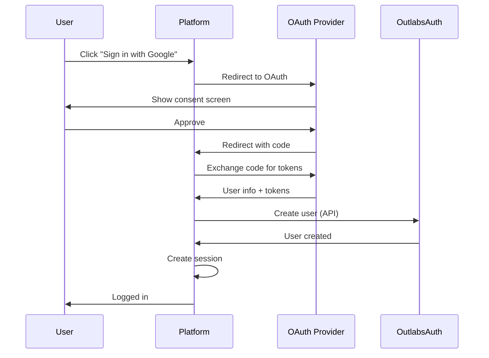
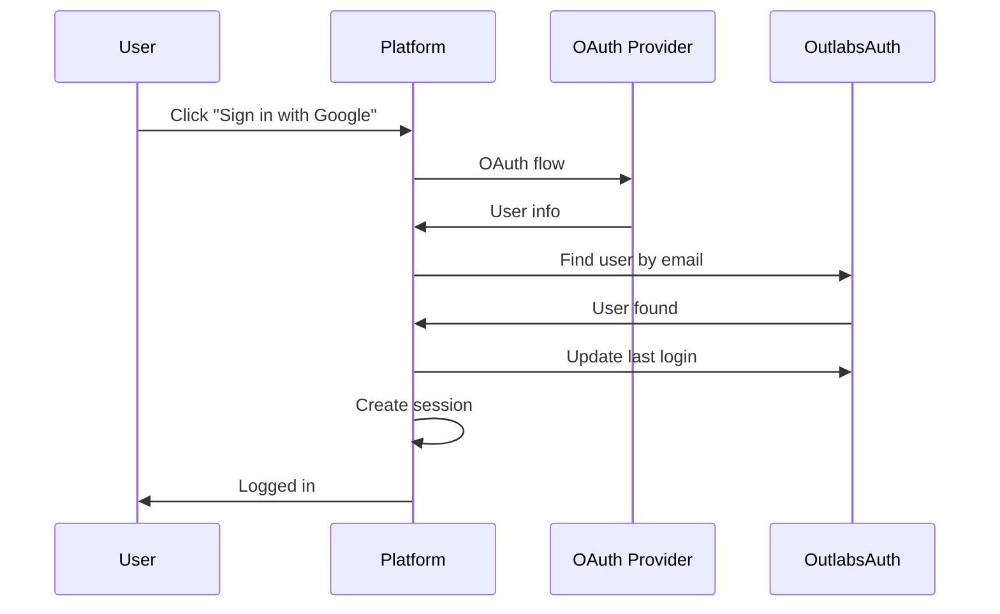
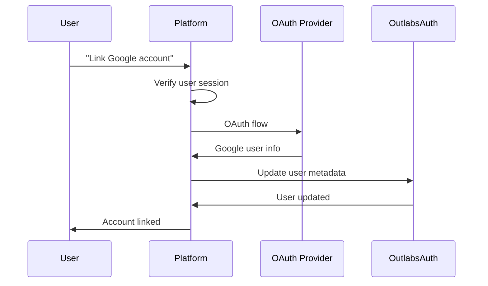

# OAuth Integration Strategy

This document outlines the recommended approach for integrating OAuth/SSO providers (Google, GitHub, Microsoft, etc.) with OutlabsAuth through the proxy pattern. This strategy keeps OAuth complexity at the platform level while leveraging OutlabsAuth for centralized user management and authorization.

## Table of Contents

1. [Overview](#overview)
2. [Architectural Decision](#architectural-decision)
3. [Integration Patterns](#integration-patterns)
4. [Implementation Guide](#implementation-guide)
5. [Provider-Specific Examples](#provider-specific-examples)
6. [User Provisioning](#user-provisioning)
7. [Account Linking](#account-linking)
8. [Security Considerations](#security-considerations)
9. [Migration Strategies](#migration-strategies)
10. [Best Practices](#best-practices)

## Overview

### Key Principle

**Platforms manage OAuth, OutlabsAuth manages users and permissions.**

This separation of concerns means:
- Each platform (e.g., Property Hub) handles its own OAuth provider integrations
- OutlabsAuth provides APIs for user creation, updates, and authentication
- Platforms map OAuth identities to OutlabsAuth users
- OutlabsAuth remains focused on authorization without OAuth complexity

### Benefits

1. **Flexibility**: Each platform can choose its own OAuth providers
2. **Simplicity**: OutlabsAuth doesn't need multi-tenant OAuth configuration
3. **Control**: Platforms manage their own OAuth apps and secrets
4. **Security**: OAuth secrets remain with the platform that owns them
5. **Scalability**: New OAuth providers can be added without modifying OutlabsAuth

## Architectural Decision

### Why Platform-Managed OAuth?

Consider the alternatives:

**Option 1: OutlabsAuth Manages OAuth (Rejected)**
- ❌ Complex multi-tenant OAuth configuration
- ❌ Each platform needs different OAuth scopes
- ❌ OAuth app management becomes complicated
- ❌ Callback URL routing complexity
- ❌ Provider-specific business logic mixed with auth

**Option 2: Platform-Managed OAuth (Recommended) ✅**
- ✅ Each platform owns its OAuth apps
- ✅ Simple user provisioning via API
- ✅ Platform-specific OAuth flows
- ✅ Clean separation of concerns
- ✅ Easier to debug and maintain

### Architecture Diagram

```
┌─────────────────┐     ┌─────────────────┐     ┌──────────────┐
│  OAuth Provider │◀───▶│  Platform API   │────▶│ OutlabsAuth  │
│  (Google, etc)  │     │  (Property Hub) │     │     API      │
└─────────────────┘     └─────────────────┘     └──────────────┘
         ▲                       │                       │
         │                       │                       │
    OAuth Flow              API Key +               User Data
                          User Creation            Permissions
```

## Integration Patterns

### Pattern 1: New User Registration via OAuth



### Pattern 2: Existing User OAuth Login



### Pattern 3: Account Linking



## Implementation Guide

### Step 1: Configure OAuth Provider

```javascript
// Platform configuration for OAuth providers
const oauthConfig = {
  google: {
    clientId: process.env.GOOGLE_CLIENT_ID,
    clientSecret: process.env.GOOGLE_CLIENT_SECRET,
    redirectUri: `${process.env.APP_URL}/auth/google/callback`,
    scope: ['openid', 'email', 'profile']
  },
  github: {
    clientId: process.env.GITHUB_CLIENT_ID,
    clientSecret: process.env.GITHUB_CLIENT_SECRET,
    redirectUri: `${process.env.APP_URL}/auth/github/callback`,
    scope: ['user:email', 'read:user']
  },
  microsoft: {
    clientId: process.env.MICROSOFT_CLIENT_ID,
    clientSecret: process.env.MICROSOFT_CLIENT_SECRET,
    redirectUri: `${process.env.APP_URL}/auth/microsoft/callback`,
    scope: ['openid', 'email', 'profile', 'User.Read']
  }
};
```

### Step 2: Implement OAuth Flow Handler

```javascript
class OAuthHandler {
  constructor(outlabsAuthClient, platformConfig) {
    this.outlabsAuth = outlabsAuthClient;
    this.config = platformConfig;
  }
  
  async handleOAuthCallback(provider, code, state) {
    // 1. Exchange code for tokens
    const oauthTokens = await this.exchangeCodeForTokens(provider, code);
    
    // 2. Get user info from OAuth provider
    const oauthUser = await this.getOAuthUserInfo(provider, oauthTokens);
    
    // 3. Check if user exists in OutlabsAuth
    let outlabsUser = await this.findUserByEmail(oauthUser.email);
    
    if (!outlabsUser) {
      // 4a. Create new user
      outlabsUser = await this.createUserFromOAuth(provider, oauthUser);
    } else {
      // 4b. Update existing user
      await this.updateUserOAuthInfo(outlabsUser.id, provider, oauthUser);
    }
    
    // 5. Generate platform session
    const session = await this.createPlatformSession({
      userId: outlabsUser.id,
      email: outlabsUser.email,
      authMethod: provider,
      oauthId: oauthUser.id
    });
    
    return { user: outlabsUser, session };
  }
  
  async createUserFromOAuth(provider, oauthUser) {
    // Prepare user data for OutlabsAuth
    const userData = {
      email: oauthUser.email,
      profile: {
        first_name: oauthUser.given_name || oauthUser.name?.split(' ')[0],
        last_name: oauthUser.family_name || oauthUser.name?.split(' ').slice(1).join(' '),
        avatar_url: oauthUser.picture || oauthUser.avatar_url
      },
      metadata: {
        auth_provider: provider,
        [`${provider}_id`]: oauthUser.id,
        email_verified: oauthUser.email_verified || false,
        created_via: 'oauth',
        oauth_data: this.sanitizeOAuthData(oauthUser)
      }
    };
    
    // Create user via OutlabsAuth API
    const response = await this.outlabsAuth.createUser(userData);
    
    // Add user to default entity/role
    await this.assignDefaultAccess(response.user.id);
    
    return response.user;
  }
  
  async updateUserOAuthInfo(userId, provider, oauthUser) {
    const updates = {
      metadata: {
        [`${provider}_id`]: oauthUser.id,
        [`${provider}_linked_at`]: new Date().toISOString(),
        last_oauth_login: new Date().toISOString()
      }
    };
    
    // Update profile if more complete
    if (oauthUser.picture && !outlabsUser.profile.avatar_url) {
      updates.profile = { avatar_url: oauthUser.picture };
    }
    
    await this.outlabsAuth.updateUser(userId, updates);
  }
}
```

### Step 3: User Provisioning Service

```javascript
class UserProvisioningService {
  constructor(outlabsAuthClient, platformConfig) {
    this.outlabsAuth = outlabsAuthClient;
    this.platformConfig = platformConfig;
  }
  
  async provisionUserFromOAuth(provider, oauthUser) {
    // Check platform-specific rules
    const provisioningRules = await this.getProvisioningRules(provider);
    
    // Validate user can be provisioned
    if (!this.canProvisionUser(oauthUser, provisioningRules)) {
      throw new Error('User does not meet provisioning requirements');
    }
    
    // Map OAuth data to OutlabsAuth user
    const userData = this.mapOAuthToUser(provider, oauthUser);
    
    // Apply platform defaults
    userData.defaultEntity = provisioningRules.defaultEntity;
    userData.defaultRoles = provisioningRules.defaultRoles;
    
    // Create user
    const user = await this.outlabsAuth.createUser(userData);
    
    // Set up initial access
    await this.setupInitialAccess(user, provisioningRules);
    
    // Send welcome email
    await this.sendWelcomeEmail(user, provider);
    
    return user;
  }
  
  canProvisionUser(oauthUser, rules) {
    // Check email domain restrictions
    if (rules.allowedDomains?.length > 0) {
      const domain = oauthUser.email.split('@')[1];
      if (!rules.allowedDomains.includes(domain)) {
        return false;
      }
    }
    
    // Check email verification requirement
    if (rules.requireVerifiedEmail && !oauthUser.email_verified) {
      return false;
    }
    
    // Check organization membership (for GitHub/Microsoft)
    if (rules.requiredOrganizations?.length > 0) {
      if (!oauthUser.organizations?.some(org => 
        rules.requiredOrganizations.includes(org)
      )) {
        return false;
      }
    }
    
    return true;
  }
  
  async setupInitialAccess(user, rules) {
    // Add to default entity
    if (rules.defaultEntity) {
      await this.outlabsAuth.addUserToEntity(
        user.id,
        rules.defaultEntity,
        rules.defaultRoles
      );
    }
    
    // Apply conditional access rules
    for (const rule of rules.conditionalAccess || []) {
      if (this.evaluateCondition(user, rule.condition)) {
        await this.outlabsAuth.addUserToEntity(
          user.id,
          rule.entityId,
          rule.roleIds
        );
      }
    }
  }
}
```

## Provider-Specific Examples

### Google OAuth Integration

```javascript
// Google OAuth handler
class GoogleOAuthHandler {
  async getAuthUrl(state) {
    const params = new URLSearchParams({
      client_id: this.config.clientId,
      redirect_uri: this.config.redirectUri,
      response_type: 'code',
      scope: this.config.scope.join(' '),
      state: state,
      access_type: 'offline', // For refresh token
      prompt: 'consent' // Force consent to get refresh token
    });
    
    return `https://accounts.google.com/o/oauth2/v2/auth?${params}`;
  }
  
  async exchangeCodeForTokens(code) {
    const response = await fetch('https://oauth2.googleapis.com/token', {
      method: 'POST',
      headers: { 'Content-Type': 'application/x-www-form-urlencoded' },
      body: new URLSearchParams({
        code,
        client_id: this.config.clientId,
        client_secret: this.config.clientSecret,
        redirect_uri: this.config.redirectUri,
        grant_type: 'authorization_code'
      })
    });
    
    return response.json();
  }
  
  async getUserInfo(accessToken) {
    const response = await fetch('https://www.googleapis.com/oauth2/v2/userinfo', {
      headers: { 'Authorization': `Bearer ${accessToken}` }
    });
    
    return response.json();
  }
  
  mapToOutlabsUser(googleUser) {
    return {
      email: googleUser.email,
      profile: {
        first_name: googleUser.given_name,
        last_name: googleUser.family_name,
        avatar_url: googleUser.picture
      },
      metadata: {
        google_id: googleUser.id,
        email_verified: googleUser.verified_email,
        locale: googleUser.locale
      }
    };
  }
}
```

### GitHub OAuth Integration

```javascript
// GitHub OAuth handler
class GitHubOAuthHandler {
  async getAuthUrl(state) {
    const params = new URLSearchParams({
      client_id: this.config.clientId,
      redirect_uri: this.config.redirectUri,
      scope: this.config.scope.join(' '),
      state: state
    });
    
    return `https://github.com/login/oauth/authorize?${params}`;
  }
  
  async exchangeCodeForTokens(code) {
    const response = await fetch('https://github.com/login/oauth/access_token', {
      method: 'POST',
      headers: { 
        'Content-Type': 'application/json',
        'Accept': 'application/json'
      },
      body: JSON.stringify({
        client_id: this.config.clientId,
        client_secret: this.config.clientSecret,
        code: code
      })
    });
    
    return response.json();
  }
  
  async getUserInfo(accessToken) {
    // Get basic user info
    const userResponse = await fetch('https://api.github.com/user', {
      headers: { 
        'Authorization': `Bearer ${accessToken}`,
        'Accept': 'application/vnd.github.v3+json'
      }
    });
    const user = await userResponse.json();
    
    // Get primary email if not public
    if (!user.email) {
      const emailsResponse = await fetch('https://api.github.com/user/emails', {
        headers: { 
          'Authorization': `Bearer ${accessToken}`,
          'Accept': 'application/vnd.github.v3+json'
        }
      });
      const emails = await emailsResponse.json();
      const primaryEmail = emails.find(e => e.primary);
      user.email = primaryEmail?.email;
    }
    
    return user;
  }
  
  mapToOutlabsUser(githubUser) {
    const names = githubUser.name?.split(' ') || [];
    
    return {
      email: githubUser.email,
      profile: {
        first_name: names[0] || githubUser.login,
        last_name: names.slice(1).join(' ') || '',
        avatar_url: githubUser.avatar_url,
        bio: githubUser.bio
      },
      metadata: {
        github_id: githubUser.id,
        github_login: githubUser.login,
        github_url: githubUser.html_url,
        company: githubUser.company,
        location: githubUser.location
      }
    };
  }
}
```

### Microsoft/Azure AD Integration

```javascript
// Microsoft OAuth handler
class MicrosoftOAuthHandler {
  async getAuthUrl(state) {
    const params = new URLSearchParams({
      client_id: this.config.clientId,
      response_type: 'code',
      redirect_uri: this.config.redirectUri,
      response_mode: 'query',
      scope: this.config.scope.join(' '),
      state: state
    });
    
    const tenant = this.config.tenant || 'common';
    return `https://login.microsoftonline.com/${tenant}/oauth2/v2.0/authorize?${params}`;
  }
  
  async exchangeCodeForTokens(code) {
    const tenant = this.config.tenant || 'common';
    const response = await fetch(
      `https://login.microsoftonline.com/${tenant}/oauth2/v2.0/token`,
      {
        method: 'POST',
        headers: { 'Content-Type': 'application/x-www-form-urlencoded' },
        body: new URLSearchParams({
          client_id: this.config.clientId,
          scope: this.config.scope.join(' '),
          code: code,
          redirect_uri: this.config.redirectUri,
          grant_type: 'authorization_code',
          client_secret: this.config.clientSecret
        })
      }
    );
    
    return response.json();
  }
  
  async getUserInfo(accessToken) {
    const response = await fetch('https://graph.microsoft.com/v1.0/me', {
      headers: { 'Authorization': `Bearer ${accessToken}` }
    });
    
    return response.json();
  }
  
  mapToOutlabsUser(microsoftUser) {
    return {
      email: microsoftUser.mail || microsoftUser.userPrincipalName,
      profile: {
        first_name: microsoftUser.givenName,
        last_name: microsoftUser.surname,
        phone: microsoftUser.mobilePhone
      },
      metadata: {
        microsoft_id: microsoftUser.id,
        job_title: microsoftUser.jobTitle,
        department: microsoftUser.department,
        office_location: microsoftUser.officeLocation
      }
    };
  }
}
```

## User Provisioning

### Provisioning Rules Configuration

```javascript
// Platform-specific provisioning rules
const provisioningRules = {
  google: {
    allowedDomains: ['company.com', 'partner.com'],
    requireVerifiedEmail: true,
    defaultEntity: 'ent_default_organization',
    defaultRoles: ['role_basic_user'],
    conditionalAccess: [
      {
        condition: { email: { endsWith: '@admin.company.com' } },
        entityId: 'ent_admin_group',
        roleIds: ['role_admin']
      }
    ]
  },
  github: {
    requiredOrganizations: ['company-org'],
    defaultEntity: 'ent_engineering',
    defaultRoles: ['role_developer'],
    conditionalAccess: [
      {
        condition: { teams: { includes: 'infrastructure' } },
        entityId: 'ent_infrastructure',
        roleIds: ['role_infrastructure_admin']
      }
    ]
  },
  microsoft: {
    tenant: 'company.onmicrosoft.com',
    requireVerifiedEmail: true,
    defaultEntity: 'ent_corporate',
    defaultRoles: ['role_employee'],
    syncGroups: true, // Sync Azure AD groups
    groupMappings: {
      'IT-Admins': { entity: 'ent_it', roles: ['role_it_admin'] },
      'HR-Team': { entity: 'ent_hr', roles: ['role_hr_manager'] }
    }
  }
};
```

### Advanced Provisioning Logic

```javascript
class AdvancedProvisioning {
  async provisionWithRules(provider, oauthUser, platformContext) {
    const rules = this.provisioningRules[provider];
    
    // 1. Validate eligibility
    const eligibility = await this.checkEligibility(oauthUser, rules);
    if (!eligibility.eligible) {
      throw new ProvisioningError(eligibility.reason);
    }
    
    // 2. Determine entity placement
    const targetEntity = await this.determineTargetEntity(
      oauthUser,
      rules,
      platformContext
    );
    
    // 3. Calculate roles
    const roles = await this.calculateRoles(
      oauthUser,
      rules,
      targetEntity
    );
    
    // 4. Create or update user
    const user = await this.createOrUpdateUser(oauthUser, {
      entity: targetEntity,
      roles: roles,
      metadata: {
        provisioned_via: provider,
        provisioning_rules_version: rules.version,
        eligibility_factors: eligibility.factors
      }
    });
    
    // 5. Post-provisioning actions
    await this.postProvisioningActions(user, provider, platformContext);
    
    return user;
  }
  
  async determineTargetEntity(oauthUser, rules, context) {
    // Check for explicit mapping
    if (rules.entityMappings) {
      for (const [key, entityId] of Object.entries(rules.entityMappings)) {
        if (this.matchesMapping(oauthUser, key)) {
          return entityId;
        }
      }
    }
    
    // Check department/division mapping
    if (oauthUser.department && rules.departmentMapping) {
      const entityId = rules.departmentMapping[oauthUser.department];
      if (entityId) return entityId;
    }
    
    // Check location-based mapping
    if (oauthUser.location && rules.locationMapping) {
      const entityId = rules.locationMapping[oauthUser.location];
      if (entityId) return entityId;
    }
    
    // Default entity
    return rules.defaultEntity;
  }
}
```

## Account Linking

### Linking Strategies

```javascript
class AccountLinkingService {
  async linkOAuthAccount(userId, provider, oauthUser, options = {}) {
    // Check if OAuth account is already linked
    const existingLink = await this.checkExistingLink(provider, oauthUser.id);
    if (existingLink) {
      if (existingLink.userId !== userId) {
        throw new Error('OAuth account already linked to another user');
      }
      return { status: 'already_linked' };
    }
    
    // Check if user already has this provider linked
    const user = await this.outlabsAuth.getUser(userId);
    if (user.metadata?.[`${provider}_id`]) {
      if (options.allowRelink) {
        await this.unlinkProvider(userId, provider);
      } else {
        throw new Error('User already has a linked account for this provider');
      }
    }
    
    // Link the account
    await this.outlabsAuth.updateUser(userId, {
      metadata: {
        [`${provider}_id`]: oauthUser.id,
        [`${provider}_linked_at`]: new Date().toISOString(),
        [`${provider}_email`]: oauthUser.email
      }
    });
    
    // Store linking record
    await this.storeLinkingRecord({
      userId,
      provider,
      providerId: oauthUser.id,
      linkedAt: new Date(),
      linkingMethod: options.method || 'user_initiated'
    });
    
    return { status: 'linked' };
  }
  
  async unlinkProvider(userId, provider) {
    // Remove provider metadata
    const updates = {
      metadata: {
        [`${provider}_id`]: null,
        [`${provider}_linked_at`]: null,
        [`${provider}_email`]: null
      }
    };
    
    await this.outlabsAuth.updateUser(userId, updates);
    
    // Remove linking record
    await this.removeLinkingRecord(userId, provider);
  }
  
  async mergeAccounts(primaryUserId, secondaryUserId, mergeOptions) {
    // Get both users
    const [primaryUser, secondaryUser] = await Promise.all([
      this.outlabsAuth.getUser(primaryUserId),
      this.outlabsAuth.getUser(secondaryUserId)
    ]);
    
    // Merge metadata
    const mergedMetadata = this.mergeMetadata(
      primaryUser.metadata,
      secondaryUser.metadata,
      mergeOptions
    );
    
    // Update primary user
    await this.outlabsAuth.updateUser(primaryUserId, {
      metadata: mergedMetadata
    });
    
    // Transfer memberships
    await this.transferMemberships(secondaryUserId, primaryUserId);
    
    // Deactivate secondary account
    await this.outlabsAuth.deactivateUser(secondaryUserId);
    
    return { merged: true, primaryUserId };
  }
}
```

## Security Considerations

### 1. State Parameter Validation

```javascript
class OAuthSecurity {
  generateState() {
    const state = crypto.randomBytes(32).toString('base64url');
    const hash = crypto.createHash('sha256').update(state).digest('hex');
    
    // Store with expiration
    this.stateStore.set(hash, {
      created: Date.now(),
      expires: Date.now() + (10 * 60 * 1000) // 10 minutes
    });
    
    return state;
  }
  
  async validateState(state) {
    const hash = crypto.createHash('sha256').update(state).digest('hex');
    const stored = await this.stateStore.get(hash);
    
    if (!stored) {
      throw new SecurityError('Invalid state parameter');
    }
    
    if (Date.now() > stored.expires) {
      throw new SecurityError('State parameter expired');
    }
    
    // Delete after use
    await this.stateStore.delete(hash);
    
    return true;
  }
}
```

### 2. Token Security

```javascript
// Secure token storage for OAuth tokens
class OAuthTokenStorage {
  async storeTokens(userId, provider, tokens) {
    // Encrypt sensitive tokens
    const encrypted = {
      access_token: await this.encrypt(tokens.access_token),
      refresh_token: tokens.refresh_token ? 
        await this.encrypt(tokens.refresh_token) : null,
      expires_at: Date.now() + (tokens.expires_in * 1000)
    };
    
    await this.storage.set(`oauth:${userId}:${provider}`, encrypted);
  }
  
  async getTokens(userId, provider) {
    const encrypted = await this.storage.get(`oauth:${userId}:${provider}`);
    if (!encrypted) return null;
    
    return {
      access_token: await this.decrypt(encrypted.access_token),
      refresh_token: encrypted.refresh_token ? 
        await this.decrypt(encrypted.refresh_token) : null,
      expires_at: encrypted.expires_at
    };
  }
  
  async encrypt(data) {
    const iv = crypto.randomBytes(16);
    const cipher = crypto.createCipheriv(
      'aes-256-gcm',
      Buffer.from(this.encryptionKey, 'hex'),
      iv
    );
    
    const encrypted = Buffer.concat([
      cipher.update(data, 'utf8'),
      cipher.final()
    ]);
    
    const tag = cipher.getAuthTag();
    
    return Buffer.concat([iv, tag, encrypted]).toString('base64');
  }
}
```

### 3. PKCE for Public Clients

```javascript
// PKCE implementation for SPAs and mobile apps
class PKCEFlow {
  generateChallenge() {
    const verifier = crypto.randomBytes(32).toString('base64url');
    const challenge = crypto.createHash('sha256')
      .update(verifier)
      .digest('base64url');
    
    return { verifier, challenge };
  }
  
  getAuthUrl(provider, state, challenge) {
    const params = new URLSearchParams({
      client_id: this.config[provider].clientId,
      redirect_uri: this.config[provider].redirectUri,
      response_type: 'code',
      scope: this.config[provider].scope.join(' '),
      state: state,
      code_challenge: challenge,
      code_challenge_method: 'S256'
    });
    
    return `${this.getProviderAuthUrl(provider)}?${params}`;
  }
  
  async exchangeCode(provider, code, verifier) {
    const params = {
      grant_type: 'authorization_code',
      client_id: this.config[provider].clientId,
      code: code,
      redirect_uri: this.config[provider].redirectUri,
      code_verifier: verifier
    };
    
    // Note: No client_secret for public clients
    return this.makeTokenRequest(provider, params);
  }
}
```

## Migration Strategies

### Migrating from Direct OAuth to Proxy Pattern

```javascript
class OAuthMigration {
  async migrateUser(legacyUserId, legacyOAuthData) {
    // 1. Create OutlabsAuth user
    const outlabsUser = await this.createOutlabsUser({
      email: legacyOAuthData.email,
      profile: this.mapLegacyProfile(legacyOAuthData),
      metadata: {
        legacy_user_id: legacyUserId,
        migrated_at: new Date().toISOString(),
        migration_version: '1.0'
      }
    });
    
    // 2. Map OAuth accounts
    for (const [provider, data] of Object.entries(legacyOAuthData.providers)) {
      await this.linkOAuthAccount(outlabsUser.id, provider, data);
    }
    
    // 3. Migrate permissions
    await this.migratePermissions(legacyUserId, outlabsUser.id);
    
    // 4. Update legacy system
    await this.updateLegacyUser(legacyUserId, {
      outlabs_user_id: outlabsUser.id,
      migration_status: 'completed'
    });
    
    return outlabsUser;
  }
  
  async bulkMigrate(options = {}) {
    const batchSize = options.batchSize || 100;
    let offset = 0;
    let migrated = 0;
    
    while (true) {
      const users = await this.getLegacyUsers(offset, batchSize);
      if (users.length === 0) break;
      
      const results = await Promise.allSettled(
        users.map(user => this.migrateUser(user.id, user.oauth_data))
      );
      
      // Log results
      results.forEach((result, index) => {
        if (result.status === 'fulfilled') {
          migrated++;
        } else {
          console.error(`Failed to migrate user ${users[index].id}:`, result.reason);
        }
      });
      
      offset += batchSize;
      
      // Progress update
      console.log(`Migrated ${migrated} users so far...`);
    }
    
    return { total: migrated };
  }
}
```

## Best Practices

### 1. Email Verification

```javascript
// Always verify email ownership
async function handleOAuthUser(provider, oauthUser) {
  // Check if email is verified by provider
  const emailVerified = oauthUser.email_verified || 
    (provider === 'github' && oauthUser.email); // GitHub verifies primary email
  
  if (!emailVerified && this.config.requireVerifiedEmail) {
    // Send verification email
    await this.sendVerificationEmail(oauthUser.email);
    throw new Error('Email verification required');
  }
  
  // Proceed with user creation/login
}
```

### 2. Handling Multiple Email Addresses

```javascript
// Handle users with multiple emails
async function findOrCreateUser(oauthUser) {
  // Check primary email
  let user = await this.findUserByEmail(oauthUser.email);
  
  // Check alternate emails
  if (!user && oauthUser.emails) {
    for (const email of oauthUser.emails) {
      user = await this.findUserByEmail(email.email);
      if (user) break;
    }
  }
  
  // Check by OAuth ID
  if (!user) {
    user = await this.findUserByOAuthId(
      oauthUser.provider,
      oauthUser.id
    );
  }
  
  return user || this.createUser(oauthUser);
}
```

### 3. Graceful Degradation

```javascript
// Handle OAuth provider downtime
class ResilientOAuth {
  async authenticate(provider, code) {
    try {
      return await this.normalOAuthFlow(provider, code);
    } catch (error) {
      if (this.isProviderError(error)) {
        // Log for monitoring
        this.logger.error(`OAuth provider ${provider} error:`, error);
        
        // Check if we can fall back
        if (this.canUseFallback(provider)) {
          return this.fallbackAuth(provider, code);
        }
        
        // Provide user-friendly error
        throw new Error(
          'Authentication service temporarily unavailable. ' +
          'Please try again or use email/password login.'
        );
      }
      
      throw error;
    }
  }
}
```

### 4. Audit Logging

```javascript
// Comprehensive OAuth audit logging
class OAuthAuditLogger {
  async logOAuthEvent(event, context) {
    const entry = {
      timestamp: new Date().toISOString(),
      event_type: event,
      provider: context.provider,
      user_id: context.userId,
      oauth_user_id: context.oauthUserId,
      ip_address: context.ipAddress,
      user_agent: context.userAgent,
      success: context.success,
      error: context.error,
      metadata: {
        email: context.email,
        first_login: context.firstLogin,
        account_linked: context.accountLinked
      }
    };
    
    await this.auditStore.create(entry);
    
    // Alert on suspicious activity
    if (this.isSuspiciousOAuth(entry)) {
      await this.alertSecurityTeam(entry);
    }
  }
}
```

## Conclusion

The platform-managed OAuth strategy provides the best balance of flexibility, security, and maintainability. By keeping OAuth complexity at the platform level and using OutlabsAuth purely for user management and authorization, you can:

1. **Maintain clean separation of concerns**
2. **Support platform-specific OAuth requirements**
3. **Simplify the OutlabsAuth implementation**
4. **Enable easier debugging and maintenance**
5. **Allow platforms to evolve their OAuth strategy independently**

This approach has been proven successful in production environments and scales well as new OAuth providers and requirements are added.